**Predicting Airline's Arrival Delays**

The goal of this project is using the US Dept. of Transportation on-time
arrival data for non-stop domestic flights by major air carriers to
predict arrival delays.

**Dataset**

The data is available on the website of Bureau of Transportation
Statistics from year 1987 to March 2017. Since the datasets for each
year are quite large, I chose to restrict my focus to year 2016, which
already contains close to 5 million records. The data for this year is
available for different months. So I downloaded the data from January
till December as twelve different excel files and then load and combine
the files into a single large dataset in R environment to carry out EDA
and predictive modeling.

**Feature Selection**

There are over 100 features available from which we can select. I
downloaded the data with only 22 selected features. After thorough
looking at the features and their explanation, I ignored the departure
flights and cancelled flights. I intended to incorporate the cause of
delay features like weather delay,carrier delay, security delay etc. but
these columns have around 90% missing values. So incorporating these in
the modeling would mean loss of the data. So I didn't include these too.
Also I didn't include departure delay as per the instructions for this
project.The final 22 variables that I selected for intial data
exploratory analysis are as follows.

1.  Year

2.  Month

3.  DayOfMonth

4.  DayOfWeek

5.  UniqueCarrier

6.  AirlineID

7.  Carrier

8.  OriginAirportID

9.  Origin

10. OriginCityName

11. DestinationAirportID

12. Destination

13. DestinationCityName

14. CRSDepartureTime : Scheduled departure time

15. DepTime : Actual departure time

16. CRSArrTime : Scheduled Arrival time

17. ArrTime : Actual arrival time

18. ArrDelayMin : Delay in minutes

19. ArrDel15 : Binary variable with 0 and 1 values. O as not arrival
delay and 1 as arrival delay(15 or &gt; 15 mins)

20. CRSElapsedTime : Scheduled Elapsed Time

21. ActElapsedTime : Actual Elapsed time

22. Distance

    #Loading all the files form Jan to Dec 2016
    file1 <- read.csv("AirDataJan.csv", sep=",", header=TRUE)
    file2 <- read.csv("AirDataFeb.csv", sep=",", header=TRUE)
    file3 <- read.csv("AirDataMarch.csv", sep=",", header=TRUE)
    file4 <- read.csv("AirDataApril.csv", sep=",", header=TRUE)
    file5 <- read.csv("AirDataMay.csv", sep=",", header=TRUE)
    file6 <- read.csv("AirDataJune.csv", sep=",", header=TRUE)
    file7 <- read.csv("AirDataJuly.csv", sep=",", header=TRUE)
    file8 <- read.csv("AirDataAug.csv", sep=",", header=TRUE)
    file9 <- read.csv("AirDataSep.csv", sep=",", header=TRUE)
    file10 <- read.csv("AirDataOct.csv", sep=",", header=TRUE)
    file11 <- read.csv("AirDataNov.csv", sep=",", header=TRUE)
    file12 <- read.csv("AirDataDec.csv", sep=",", header=TRUE)

    #Combine all the files into one single dataset
    data <- rbind(file1,file2,file3,file4,file5,file6,file7,file8,file9,file10,file11,file12)

**EXPLORATORY DATA ANALYSIS**

    head(data)

    ##   YEAR MONTH DAY_OF_MONTH DAY_OF_WEEK UNIQUE_CARRIER AIRLINE_ID CARRIER
    ## 1 2016     1            1           5             DL      19790      DL
    ## 2 2016     1            1           5             DL      19790      DL
    ## 3 2016     1            1           5             DL      19790      DL
    ## 4 2016     1            1           5             DL      19790      DL
    ## 5 2016     1            1           5             DL      19790      DL
    ## 6 2016     1            1           5             DL      19790      DL
    ##   ORIGIN_AIRPORT_ID ORIGIN   ORIGIN_CITY_NAME DEST_AIRPORT_ID DEST
    ## 1             11433    DTW        Detroit, MI           12892  LAX
    ## 2             10397    ATL        Atlanta, GA           11986  GRR
    ## 3             12892    LAX    Los Angeles, CA           10397  ATL
    ## 4             14869    SLC Salt Lake City, UT           10397  ATL
    ## 5             10849    BZN        Bozeman, MT           13487  MSP
    ## 6             10397    ATL        Atlanta, GA           10693  BNA
    ##     DEST_CITY_NAME CRS_DEP_TIME DEP_TIME CRS_ARR_TIME ARR_TIME
    ## 1  Los Angeles, CA         1935     1935         2144     2120
    ## 2 Grand Rapids, MI         2125     2130         2321     2319
    ## 3      Atlanta, GA         2255     2256          600      547
    ## 4      Atlanta, GA         1656     1700         2229     2213
    ## 5  Minneapolis, MN          900     1012         1216     1420
    ## 6    Nashville, TN         1233     1356         1239     1402
    ##   ARR_DELAY_NEW ARR_DEL15 CRS_ELAPSED_TIME ACTUAL_ELAPSED_TIME DISTANCE  X
    ## 1             0         0              309                 285     1979 NA
    ## 2             0         0              116                 109      640 NA
    ## 3             0         0              245                 231     1947 NA
    ## 4             0         0              213                 193     1590 NA
    ## 5           124         1              136                 188      874 NA
    ## 6            83         1               66                  66      214 NA

    str(data)

    ## 'data.frame':    5617658 obs. of  23 variables:
    ##  $ YEAR               : int  2016 2016 2016 2016 2016 2016 2016 2016 2016 2016 ...
    ##  $ MONTH              : int  1 1 1 1 1 1 1 1 1 1 ...
    ##  $ DAY_OF_MONTH       : int  1 1 1 1 1 1 1 1 1 1 ...
    ##  $ DAY_OF_WEEK        : int  5 5 5 5 5 5 5 5 5 5 ...
    ##  $ UNIQUE_CARRIER     : Factor w/ 12 levels "AA","AS","B6",..: 4 4 4 4 4 4 4 4 4 4 ...
    ##  $ AIRLINE_ID         : int  19790 19790 19790 19790 19790 19790 19790 19790 19790 19790 ...
    ##  $ CARRIER            : Factor w/ 12 levels "AA","AS","B6",..: 4 4 4 4 4 4 4 4 4 4 ...
    ##  $ ORIGIN_AIRPORT_ID  : int  11433 10397 12892 14869 10849 10397 10693 10397 12451 10397 ...
    ##  $ ORIGIN             : Factor w/ 313 levels "ABE","ABQ","ABR",..: 82 17 159 265 49 17 34 17 148 17 ...
    ##  $ ORIGIN_CITY_NAME   : Factor w/ 308 levels "Aberdeen, SD",..: 76 17 166 240 38 17 193 17 135 17 ...
    ##  $ DEST_AIRPORT_ID    : int  12892 11986 10397 10397 13487 10693 10397 12451 10397 13851 ...
    ##  $ DEST               : Factor w/ 310 levels "ABE","ABQ","ABR",..: 159 116 17 17 198 34 17 148 17 205 ...
    ##  $ DEST_CITY_NAME     : Factor w/ 306 levels "Aberdeen, SD",..: 166 105 17 17 180 193 17 135 17 205 ...
    ##  $ CRS_DEP_TIME       : int  1935 2125 2255 1656 900 1233 1320 945 1145 2110 ...
    ##  $ DEP_TIME           : int  1935 2130 2256 1700 1012 1356 1446 946 1144 2107 ...
    ##  $ CRS_ARR_TIME       : int  2144 2321 600 2229 1216 1239 1530 1050 1302 2236 ...
    ##  $ ARR_TIME           : int  2120 2319 547 2213 1420 1402 1644 1053 1247 2224 ...
    ##  $ ARR_DELAY_NEW      : num  0 0 0 0 124 83 74 3 0 0 ...
    ##  $ ARR_DEL15          : num  0 0 0 0 1 1 1 0 0 0 ...
    ##  $ CRS_ELAPSED_TIME   : num  309 116 245 213 136 66 70 65 77 146 ...
    ##  $ ACTUAL_ELAPSED_TIME: num  285 109 231 193 188 66 58 67 63 137 ...
    ##  $ DISTANCE           : num  1979 640 1947 1590 874 ...
    ##  $ X                  : logi  NA NA NA NA NA NA ...

    summary(data)

    ##       YEAR          MONTH         DAY_OF_MONTH    DAY_OF_WEEK   
    ##  Min.   :2016   Min.   : 1.000   Min.   : 1.00   Min.   :1.000  
    ##  1st Qu.:2016   1st Qu.: 4.000   1st Qu.: 8.00   1st Qu.:2.000  
    ##  Median :2016   Median : 7.000   Median :16.00   Median :4.000  
    ##  Mean   :2016   Mean   : 6.536   Mean   :15.78   Mean   :3.934  
    ##  3rd Qu.:2016   3rd Qu.: 9.000   3rd Qu.:23.00   3rd Qu.:6.000  
    ##  Max.   :2016   Max.   :12.000   Max.   :31.00   Max.   :7.000  
    ##                                                                 
    ##  UNIQUE_CARRIER      AIRLINE_ID       CARRIER        ORIGIN_AIRPORT_ID
    ##  WN     :1299444   Min.   :19393   WN     :1299444   Min.   :10135    
    ##  DL     : 922746   1st Qu.:19790   DL     : 922746   1st Qu.:11292    
    ##  AA     : 914495   Median :19805   AA     : 914495   Median :12889    
    ##  OO     : 605933   Mean   :19902   OO     : 605933   Mean   :12681    
    ##  UA     : 545067   3rd Qu.:20304   UA     : 545067   3rd Qu.:14057    
    ##  EV     : 490990   Max.   :21171   EV     : 490990   Max.   :16218    
    ##  (Other): 838983                   (Other): 838983                    
    ##      ORIGIN                     ORIGIN_CITY_NAME   DEST_AIRPORT_ID
    ##  ATL    : 384375   Atlanta, GA          : 384375   Min.   :10135  
    ##  ORD    : 244082   Chicago, IL          : 331891   1st Qu.:11292  
    ##  DEN    : 226136   Denver, CO           : 226136   Median :12889  
    ##  LAX    : 212983   Los Angeles, CA      : 212983   Mean   :12680  
    ##  DFW    : 196049   Dallas/Fort Worth, TX: 196049   3rd Qu.:14057  
    ##  SFO    : 172358   New York, NY         : 194320   Max.   :16218  
    ##  (Other):4181675   (Other)              :4071904                  
    ##       DEST                       DEST_CITY_NAME     CRS_DEP_TIME 
    ##  ATL    : 384252   Atlanta, GA          : 384252   Min.   :   1  
    ##  ORD    : 243889   Chicago, IL          : 331691   1st Qu.: 915  
    ##  DEN    : 226225   Denver, CO           : 226225   Median :1325  
    ##  LAX    : 212972   Los Angeles, CA      : 212972   Mean   :1331  
    ##  DFW    : 196031   Dallas/Fort Worth, TX: 196031   3rd Qu.:1735  
    ##  SFO    : 172398   New York, NY         : 194312   Max.   :2359  
    ##  (Other):4181891   (Other)              :4072175                 
    ##     DEP_TIME      CRS_ARR_TIME     ARR_TIME     ARR_DELAY_NEW    
    ##  Min.   :   1    Min.   :   1   Min.   :   1    Min.   :   0.00  
    ##  1st Qu.: 917    1st Qu.:1105   1st Qu.:1052    1st Qu.:   0.00  
    ##  Median :1328    Median :1520   Median :1511    Median :   0.00  
    ##  Mean   :1334    Mean   :1491   Mean   :1472    Mean   :  11.85  
    ##  3rd Qu.:1742    3rd Qu.:1920   3rd Qu.:1918    3rd Qu.:   6.00  
    ##  Max.   :2400    Max.   :2400   Max.   :2400    Max.   :2142.00  
    ##  NA's   :63456                  NA's   :67844   NA's   :79513    
    ##    ARR_DEL15     CRS_ELAPSED_TIME ACTUAL_ELAPSED_TIME    DISTANCE     
    ##  Min.   :0.00    Min.   :  5.0    Min.   : 14.0       Min.   :  25.0  
    ##  1st Qu.:0.00    1st Qu.: 88.0    1st Qu.: 84.0       1st Qu.: 391.0  
    ##  Median :0.00    Median :126.0    Median :121.0       Median : 678.0  
    ##  Mean   :0.17    Mean   :145.4    Mean   :140.2       Mean   : 850.1  
    ##  3rd Qu.:0.00    3rd Qu.:178.0    3rd Qu.:173.0       3rd Qu.:1091.0  
    ##  Max.   :1.00    Max.   :705.0    Max.   :778.0       Max.   :4983.0  
    ##  NA's   :79513   NA's   :6        NA's   :79513                       
    ##     X          
    ##  Mode:logical  
    ##  NA's:5617658  
    ##                
    ##                
    ##                
    ##                
    ## 

After looking at the summary statistics of dataset, I just ignored the
following variables and then omit all the missing values form the
dataset.

**Cleaning the data**

    data[,c("YEAR","DAY_OF_MONTH","UNIQUE_CARRIER","ORIGIN_CITY_NAME","DEST_CITY_NAME","X")] <- NULL

    #omit missing values
    data <- na.omit(data)

    #how many flights arrived late 0 as not and 1 as yes
    table(data$ARR_DEL15)

    ## 
    ##       0       1 
    ## 4573906  964239

Next I consider the impact of different features like month, day of the
week, carrier, origin airport, destination airport, departure time and
distance on the total arrival delay in minutes.

**Impact of the month of a year on arrival delay**

    library(plyr)
    Daily_ArrDly <- tapply(data$ARR_DELAY_NEW, data$MONTH, sum)
    print(Daily_ArrDly)

    ##       1       2       3       4       5       6       7       8       9 
    ## 4573912 4376973 5374121 4311045 4921993 6932882 8614301 7533450 4112545 
    ##      10      11      12 
    ## 3982471 3698520 7179630

    barplot(Daily_ArrDly/1000, lwd = 2, col = "Darkblue",main = "Total Arrival Delay", xlab = "Months of a year", ylab = "Total Arrival Delay in Min")

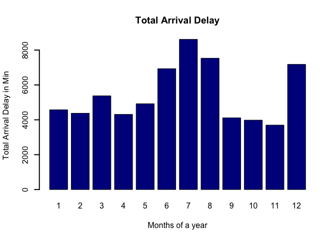

The barplot reveals the potential effects of months on the arrival
delays. For the summer months in which there are holidays and more
flights, June and July are marked by higher delays followed by December.

**Plot for number of flights per month for year 2016**

    No_Flght_Mnth <- count(data$MONTH)
    print(No_Flght_Mnth)

    ##     x   freq
    ## 1   1 433298
    ## 2   2 416097
    ## 3   3 473286
    ## 4   4 456702
    ## 5   5 475499
    ## 6   6 480916
    ## 7   7 491198
    ## 8   8 489965
    ## 9   9 452558
    ## 10 10 467486
    ## 11 11 448911
    ## 12 12 452229

    plot(No_Flght_Mnth$x, No_Flght_Mnth$freq/1000,xlab="Month",ylab="Number of flights") 

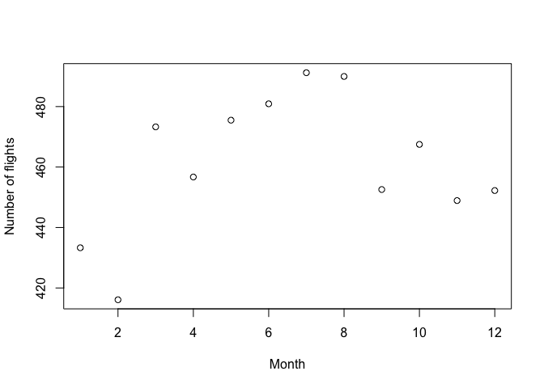
The plot also shows that July and August are the busiest months with the
highest number of flights.

**Effect of days of the week on arrival delay**

    Daily_ArrDly <- tapply(data$ARR_DELAY_NEW, data$DAY_OF_WEEK, sum)
    print(Daily_ArrDly)

    ##        1        2        3        4        5        6        7 
    ##  9872029  8899755  8737488 10635835 11046139  7239140  9181457

    barplot(Daily_ArrDly/1000, lwd = 2, col = "Darkblue",main = "Total Daily Arrival Delay", xlab = "Days of Week", ylab = "Total Arrival Delay in Min")

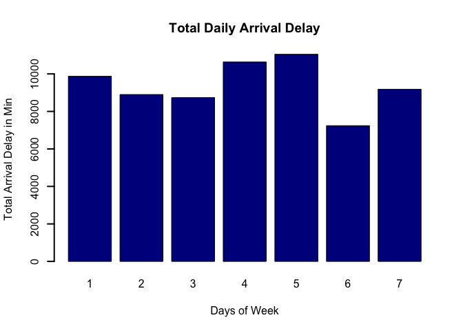

The barplot shows that arrival delays are different for different days
of the week. The arrival delays are highest on Friday followed by
Thursday and Monday.

**Number of flights per day of the week**

    No_Flght_Day <- count(data$DAY_OF_WEEK)
    print(No_Flght_Day)

    ##   x   freq
    ## 1 1 817286
    ## 2 2 804151
    ## 3 3 812770
    ## 4 4 821834
    ## 5 5 835806
    ## 6 6 676559
    ## 7 7 769739

    plot(No_Flght_Day$x, No_Flght_Day$freq/1000,xlab="Day of week",ylab="Number of flights") 

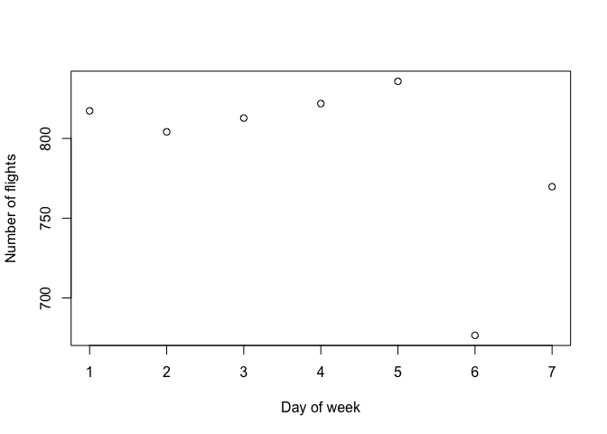

**Arrival delays due to carrier/airline**

    Carrier_ArrDly <- tapply(data$ARR_DELAY_NEW, data$CARRIER, sum)
    print(Carrier_ArrDly)

    ##       AA       AS       B6       DL       EV       F9       HA       NK 
    ## 11736094  1204195  4542959  8885414  6750214  1613105   380329  2224785 
    ##       OO       UA       VX       WN 
    ##  7359049  6783062   981317 13151320

    barplot(Carrier_ArrDly/1000, lwd = 2, col = "Darkblue",main = "Carrier Arrival Delay", xlab = "Carrier", ylab = "Total Arrival Delay in Min")

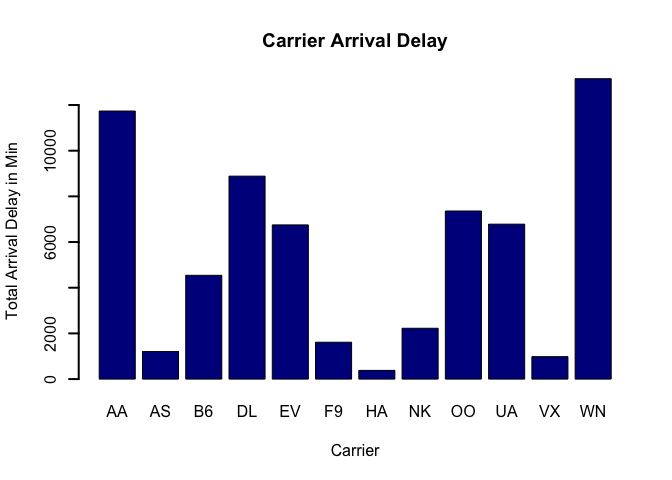

Southwest airlines has the highest record of total arrival delyas
followed by American Airlines. I think it might be related to the total
number of flights for a particular carrier. More the flights, more the
arrival delays.

**Number of flights for carrier**

    No_Flght_Car <- count(data$CARRIER)
    print(No_Flght_Car)

    ##     x    freq
    ## 1  AA  901412
    ## 2  AS  176013
    ## 3  B6  278011
    ## 4  DL  916896
    ## 5  EV  477524
    ## 6  F9   93792
    ## 7  HA   76587
    ## 8  NK  135371
    ## 9  OO  595578
    ## 10 UA  538190
    ## 11 VX   68257
    ## 12 WN 1280514

    plot(No_Flght_Car$x, No_Flght_Car$freq/1000, 
         main = "Number of Flights per Carrier", xlab = "Carrier", 
         ylab = "Frequency in '000")

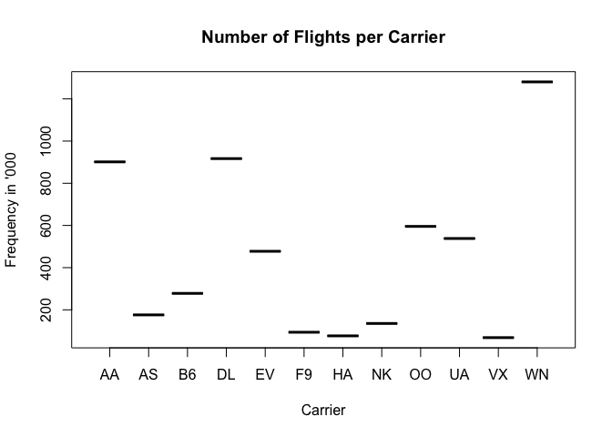

**Impact of origin airport**

    Origin_ArrDly <- tapply(data$ARR_DELAY_NEW,data$ORIGIN, sum)
    print(Origin_ArrDly)

    ##     ABE     ABQ     ABR     ABY     ACT     ACV     ACY     ADK     ADQ 
    ##   31611  202049    7998   11565   18323   23402   58144     817    3059 
    ##     AEX     AGS     ALB     AMA     ANC     APN     ASE     ATL     ATW 
    ##   38170   34080   85263   23307  105712    9752   75574 3760906   33658 
    ##     AUS     AVL     AVP     AZO     BDL     BET     BFL     BGM     BGR 
    ##  491032   51760   20222   27579  191239    3208   27953   12927    9020 
    ##     BHM     BIL     BIS     BJI     BLI     BMI     BNA     BOI     BOS 
    ##  132301   22893   29342    8211    5408   17522  578452  160000 1443891 
    ##     BPT     BQK     BQN     BRD     BRO     BRW     BTM     BTR     BTV 
    ##   12638   13346   24314    7467   21092    4603    6075  112328   61137 
    ##     BUF     BUR     BWI     BZN     CAE     CAK     CDC     CDV     CHA 
    ##  190707  225274 1002948   41244   63552   63415    4450    4036   72225 
    ##     CHO     CHS     CID     CIU     CLE     CLL     CLT     CMH     CMX 
    ##   42369  174181   54958   11877  411285    9848 1237905  227647   15593 
    ##     COD     COS     CPR     CRP     CRW     CSG     CVG     CWA     DAB 
    ##   10523  115161   12785   22385   40306   13382  194503    9429   23028 
    ##     DAL     DAY     DCA     DEN     DFW     DHN     DLH     DRO     DSM 
    ##  817999   75876  937477 2563368 2775246   20050   37570   25646   89716 
    ##     DTW     DVL     EAU     ECP     EGE     EKO     ELM     ELP     ERI 
    ## 1439526    7174    8538   36808   25022    4897   16634  116611   11719 
    ##     ESC     EUG     EVV     EWN     EWR     EYW     FAI     FAR     FAT 
    ##    8259   57001   41349    9912 1732037   19651   17270   51750  112554 
    ##     FAY     FCA     FLG     FLL     FNT     FSD     FSM     FWA     GCC 
    ##   19247   20189   15907 1165027   29917   54665   13765   56843    8453 
    ##     GEG     GFK     GJT     GNV     GPT     GRB     GRK     GRR     GSO 
    ##   79966   17232   19485   29994   35390   37526   17606  101266   76748 
    ##     GSP     GTF     GTR     GUC     GUM     HDN     HIB     HLN     HNL 
    ##   83732   17462   13933    5005    3516   12807   17101    8687  257549 
    ##     HOB     HOU     HPN     HRL     HSV     HYS     IAD     IAG     IAH 
    ##    6390  587186  115616   24353   35287    6074  402805    4322 1497099 
    ##     ICT     IDA     ILM     IMT     IND     INL     ISN     ISP     ITH 
    ##   85660   22715   32474    7379  280967   10333   18470   39824   14492 
    ##     ITO     JAC     JAN     JAX     JFK     JLN     JMS     JNU     KOA 
    ##   26521   63773   56387  195326 1531760    5359   11529   31952   78932 
    ##     KTN     LAN     LAR     LAS     LAW     LAX     LBB     LBE     LCH 
    ##   18651   32991    6742 1837875   17081 2928873   40478   14230   14646 
    ##     LEX     LFT     LGA     LGB     LIH     LIT     LNK     LRD     LSE 
    ##   71379   40103 1543195  137633   64234   74120   34868   27472    6050 
    ##     LWS     MAF     MBS     MCI     MCO     MDT     MDW     MEI     MEM 
    ##    4165   51635   25228  428540 1596676   30647  845314   22393  144315 
    ##     MFE     MFR     MGM     MHT     MIA     MKE     MKG     MLB     MLI 
    ##   25950   42995   34683   59879 1104403  346496   10432   13793   34659 
    ##     MLU     MMH     MOB     MOT     MQT     MRY     MSN     MSO     MSP 
    ##   41878    2403   60670   21472   15216   32015   77830   24290 1441023 
    ##     MSY     MTJ     MYR     OAJ     OAK     OGG     OKC     OMA     OME 
    ##  453175   14908   77389   19036  499685  164705  143863  180941    4605 
    ##     ONT     ORD     ORF     ORH     OTH     OTZ     PAH     PBG     PBI 
    ##  210391 3673657  138253   12515    6917    3632   10580    3985  351501 
    ##     PDX     PHF     PHL     PHX     PIA     PIB     PIH     PIT     PLN 
    ##  519453   10599  897950 1601654   42721   11298    7488  217641   17802 
    ##     PNS     PPG     PSC     PSE     PSG     PSP     PVD     PWM     RAP 
    ##   54225    7272   43592    8304    4705  152860  111384   89897   33548 
    ##     RDD     RDM     RDU     RHI     RIC     RKS     RNO     ROA     ROC 
    ##   14299   43613  406371   12977  227432    4981  161396   27064   81982 
    ##     ROW     RST     RSW     SAF     SAN     SAT     SAV     SBA     SBN 
    ##    4654   15679  348318   27233  786276  302477   96296   98221   71254 
    ##     SBP     SCC     SCE     SDF     SEA     SFO     SGF     SGU     SHV 
    ##   43947    3198   10284  110554 1200437 2438143   33185   14193   81346 
    ##     SIT     SJC     SJU     SLC     SMF     SMX     SNA     SPI     SRQ 
    ##   10274  420150  304062  944330  435577   10307  391044   24462   44244 
    ##     STL     STT     STX     SUN     SWF     SYR     TLH     TPA     TRI 
    ##  611602   63440   12578   15789   10695   81037   25774  748719   28404 
    ##     TTN     TUL     TUS     TVC     TWF     TXK     TYR     TYS     UST 
    ##   31243  123819  174435   29189    9387   15346    2286   92804    3441 
    ##     VLD     VPS     WRG     XNA     YAK     YUM     GGG     SJT     SPS 
    ##   13308   43997    5971   82438    2932   13579    7635   18436   12183 
    ##     ACK     BFF     HYA     MVY     WYS     ABI     AKN     DLG     GCK 
    ##   11306      NA    1613    5660    1677    2511     508     621   11676 
    ##     GST     MHK     GRI     EFD     PGD     SPN     ENV 
    ##     660       0    6014      56    1018      15      NA

    barplot(Origin_ArrDly/1000, lwd = 2, col = "Darkblue",main = "Origin Airport Arrival Delay", xlab = "ORIGIN", ylab = "Total Arrival Delay in Min")

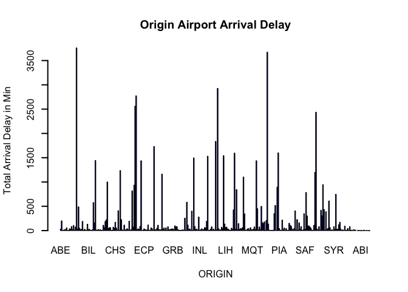

**Number of flights of origin airport**

    No_Flght_Origin <- count(data$ORIGIN)
    print(No_Flght_Origin)

    ##       x   freq
    ## 1   ABE   2323
    ## 2   ABQ  18766
    ## 3   ABR    733
    ## 4   ABY    999
    ## 5   ACT   1376
    ## 6   ACV   1361
    ## 7   ACY   3600
    ## 8   ADK    101
    ## 9   ADQ    523
    ## 10  AEX   2808
    ## 11  AGS   2624
    ## 12  ALB   9236
    ## 13  AMA   3027
    ## 14  ANC  17115
    ## 15  APN    621
    ## 16  ASE   4347
    ## 17  ATL 381303
    ## 18  ATW   3307
    ## 19  AUS  45826
    ## 20  AVL   3330
    ## 21  AVP   1627
    ## 22  AZO   2014
    ## 23  BDL  20062
    ## 24  BET    957
    ## 25  BFL   2572
    ## 26  BGM    872
    ## 27  BGR    594
    ## 28  BHM  12117
    ## 29  BIL   3371
    ## 30  BIS   2328
    ## 31  BJI    726
    ## 32  BLI    596
    ## 33  BMI   1500
    ## 34  BNA  50974
    ## 35  BOI  14570
    ## 36  BOS 119388
    ## 37  BPT    529
    ## 38  BQK   1016
    ## 39  BQN   1826
    ## 40  BRD    628
    ## 41  BRO   1987
    ## 42  BRW    910
    ## 43  BTM    669
    ## 44  BTR   6752
    ## 45  BTV   3887
    ## 46  BUF  17663
    ## 47  BUR  22110
    ## 48  BWI  94382
    ## 49  BZN   4208
    ## 50  CAE   4363
    ## 51  CAK   5217
    ## 52  CDC    625
    ## 53  CDV    710
    ## 54  CHA   4544
    ## 55  CHO   2348
    ## 56  CHS  14325
    ## 57  CID   4383
    ## 58  CIU    678
    ## 59  CLE  33546
    ## 60  CLL   1113
    ## 61  CLT 109255
    ## 62  CMH  22788
    ## 63  CMX    691
    ## 64  COD    910
    ## 65  COS   8159
    ## 66  CPR   1457
    ## 67  CRP   2908
    ## 68  CRW   2490
    ## 69  CSG   1226
    ## 70  CVG  15315
    ## 71  CWA    781
    ## 72  DAB   1959
    ## 73  DAL  68100
    ## 74  DAY   6359
    ## 75  DCA  75880
    ## 76  DEN 222418
    ## 77  DFW 193297
    ## 78  DHN   1368
    ## 79  DLH   2405
    ## 80  DRO   1923
    ## 81  DSM   7668
    ## 82  DTW 122759
    ## 83  DVL    564
    ## 84  EAU    660
    ## 85  ECP   4463
    ## 86  EGE   1680
    ## 87  EKO    627
    ## 88  ELM   1824
    ## 89  ELP  11234
    ## 90  ERI    719
    ## 91  ESC    617
    ## 92  EUG   3487
    ## 93  EVV   2682
    ## 94  EWN    699
    ## 95  EWR 112530
    ## 96  EYW   1739
    ## 97  FAI   2462
    ## 98  FAR   3881
    ## 99  FAT   8225
    ## 100 FAY   1676
    ## 101 FCA   2343
    ## 102 FLG   1814
    ## 103 FLL  82088
    ## 104 FNT   3808
    ## 105 FSD   4136
    ## 106 FSM   1147
    ## 107 FWA   4139
    ## 108 GCC   1018
    ## 109 GEG   9968
    ## 110 GFK   1535
    ## 111 GJT   2896
    ## 112 GNV   2262
    ## 113 GPT   3101
    ## 114 GRB   3668
    ## 115 GRK   1905
    ## 116 GRR   9045
    ## 117 GSO   5913
    ## 118 GSP   7009
    ## 119 GTF   1817
    ## 120 GTR   1005
    ## 121 GUC    237
    ## 122 GUM    366
    ## 123 HDN    998
    ## 124 HIB    963
    ## 125 HLN   1662
    ## 126 HNL  47126
    ## 127 HOB    601
    ## 128 HOU  53418
    ## 129 HPN   6983
    ## 130 HRL   2938
    ## 131 HSV   4024
    ## 132 HYS    603
    ## 133 IAD  33846
    ## 134 IAG    380
    ## 135 IAH 135090
    ## 136 ICT   7741
    ## 137 IDA   2447
    ## 138 ILM   2549
    ## 139 IMT    656
    ## 140 IND  26486
    ## 141 INL    605
    ## 142 ISN   1611
    ## 143 ISP   4607
    ## 144 ITH    892
    ## 145 ITO   5959
    ## 146 JAC   3878
    ## 147 JAN   5128
    ## 148 JAX  18287
    ## 149 JFK  96232
    ## 150 JLN    423
    ## 151 JMS    887
    ## 152 JNU   4534
    ## 153 KOA  12344
    ## 154 KTN   2440
    ## 155 LAN   2379
    ## 156 LAR    601
    ## 157 LAS 149083
    ## 158 LAW   1123
    ## 159 LAX 210593
    ## 160 LBB   4503
    ## 161 LBE   1018
    ## 162 LCH   1233
    ## 163 LEX   5063
    ## 164 LFT   3035
    ## 165 LGA  93885
    ## 166 LGB  11063
    ## 167 LIH  11759
    ## 168 LIT   8279
    ## 169 LNK   2991
    ## 170 LRD   2079
    ## 171 LSE    751
    ## 172 LWS    713
    ## 173 MAF   5741
    ## 174 MBS   1945
    ## 175 MCI  43024
    ## 176 MCO 123854
    ## 177 MDT   2505
    ## 178 MDW  86030
    ## 179 MEI    982
    ## 180 MEM  13911
    ## 181 MFE   2188
    ## 182 MFR   2916
    ## 183 MGM   2432
    ## 184 MHT   6578
    ## 185 MIA  68701
    ## 186 MKE  32129
    ## 187 MKG    654
    ## 188 MLB   1504
    ## 189 MLI   2496
    ## 190 MLU   3020
    ## 191 MMH     91
    ## 192 MOB   4824
    ## 193 MOT   1624
    ## 194 MQT    682
    ## 195 MRY   2463
    ## 196 MSN   7399
    ## 197 MSO   2646
    ## 198 MSP 128026
    ## 199 MSY  43053
    ## 200 MTJ   1077
    ## 201 MYR   5593
    ## 202 OAJ   1245
    ## 203 OAK  48171
    ## 204 OGG  23195
    ## 205 OKC  15480
    ## 206 OMA  17703
    ## 207 OME    705
    ## 208 ONT  19391
    ## 209 ORD 239478
    ## 210 ORF  10804
    ## 211 ORH    695
    ## 212 OTH    290
    ## 213 OTZ    700
    ## 214 PAH    656
    ## 215 PBG    366
    ## 216 PBI  23879
    ## 217 PDX  58169
    ## 218 PHF   1110
    ## 219 PHL  72129
    ## 220 PHX 157817
    ## 221 PIA   2895
    ## 222 PIB    619
    ## 223 PIH    919
    ## 224 PIT  24980
    ## 225 PLN   1077
    ## 226 PNS   5900
    ## 227 PPG    121
    ## 228 PSC   3757
    ## 229 PSE    847
    ## 230 PSG    718
    ## 231 PSP   9898
    ## 232 PVD  12434
    ## 233 PWM   6165
    ## 234 RAP   2957
    ## 235 RDD    958
    ## 236 RDM   2733
    ## 237 RDU  34382
    ## 238 RHI   1015
    ## 239 RIC  15561
    ## 240 RKS    635
    ## 241 RNO  13955
    ## 242 ROA   2160
    ## 243 ROC   7182
    ## 244 ROW    437
    ## 245 RST   1194
    ## 246 RSW  28877
    ## 247 SAF   1174
    ## 248 SAN  77184
    ## 249 SAT  30543
    ## 250 SAV   7137
    ## 251 SBA   5853
    ## 252 SBN   5236
    ## 253 SBP   3133
    ## 254 SCC    800
    ## 255 SCE    722
    ## 256 SDF   9776
    ## 257 SEA 131783
    ## 258 SFO 169497
    ## 259 SGF   2734
    ## 260 SGU   2068
    ## 261 SHV   5849
    ## 262 SIT   1355
    ## 263 SJC  41607
    ## 264 SJU  26568
    ## 265 SLC 108061
    ## 266 SMF  40845
    ## 267 SMX    540
    ## 268 SNA  42072
    ## 269 SPI   1687
    ## 270 SRQ   3246
    ## 271 STL  54884
    ## 272 STT   4915
    ## 273 STX   1102
    ## 274 SUN   1126
    ## 275 SWF    716
    ## 276 SYR   5740
    ## 277 TLH   2540
    ## 278 TPA  67167
    ## 279 TRI   2142
    ## 280 TTN   2074
    ## 281 TUL  13784
    ## 282 TUS  15893
    ## 283 TVC   2168
    ## 284 TWF   1085
    ## 285 TXK    833
    ## 286 TYR    412
    ## 287 TYS   7066
    ## 288 UST    191
    ## 289 VLD   1022
    ## 290 VPS   4145
    ## 291 WRG    713
    ## 292 XNA   5680
    ## 293 YAK    702
    ## 294 YUM   1959
    ## 295 GGG    367
    ## 296 SJT    983
    ## 297 SPS    817
    ## 298 ACK    608
    ## 299 HYA    120
    ## 300 MVY    247
    ## 301 WYS    224
    ## 302 ABI    157
    ## 303 AKN     63
    ## 304 DLG     83
    ## 305 GCK    417
    ## 306 GST     83
    ## 307 MHK      1
    ## 308 GRI    312
    ## 309 EFD      1
    ## 310 PGD     78
    ## 311 SPN      1

    plot(No_Flght_Origin$x, No_Flght_Origin$freq/1000,xlab="Origin Airport",ylab="Number of flights") 

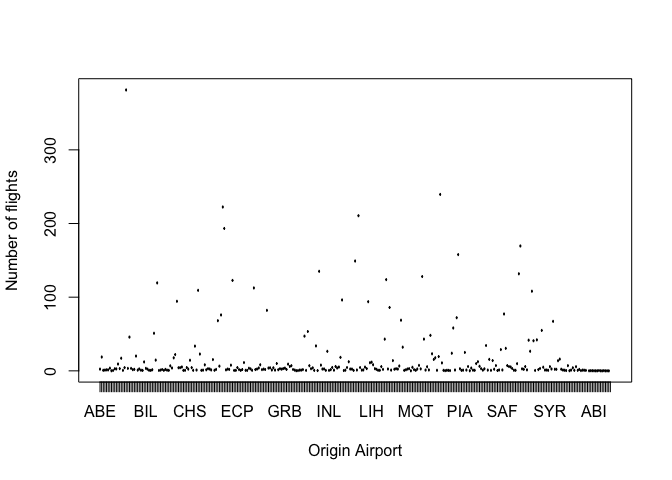

    Destination_ArrDly <- tapply(data$ARR_DELAY_NEW, data$DEST, sum)
    print(Destination_ArrDly)

    ##     ABE     ABQ     ABR     ABY     ACT     ACV     ACY     ADK     ADQ 
    ##   29101  200069    6138   13640   17417   20393   67064     602    2013 
    ##     AEX     AGS     ALB     AMA     ANC     APN     ASE     ATL     ATW 
    ##   31107   33431   97090   26822  106385   10616   62226 3938293   30844 
    ##     AUS     AVL     AVP     AZO     BDL     BET     BFL     BGM     BGR 
    ##  517808   42139   17910   24895  229330    2963   30313   11391    9813 
    ##     BHM     BIL     BIS     BJI     BLI     BMI     BNA     BOI     BOS 
    ##  125812   26808   23953    8908    4438   16013  530999  155195 1628219 
    ##     BPT     BQK     BQN     BRD     BRO     BRW     BTM     BTR     BTV 
    ##    9799   13583   30624    4733   17806    4028    6876   90483   52612 
    ##     BUF     BUR     BWI     BZN     CAE     CAK     CDC     CDV     CHA 
    ##  207166  206959  901762   38918   63009   56108    4789    2928   68448 
    ##     CHO     CHS     CID     CIU     CLE     CLL     CLT     CMH     CMX 
    ##   39572  150189   47895    6898  430886    9713 1006661  227447   10386 
    ##     COD     COS     CPR     CRP     CRW     CSG     CVG     CWA     DAB 
    ##    4752  117636    8872   23012   29940   14687  178756    7590   18341 
    ##     DAL     DAY     DCA     DEN     DFW     DHN     DLH     DRO     DSM 
    ##  701299   65539  929980 2392183 2779141   19293   28741   17682   86060 
    ##     DTW     DVL     EAU     ECP     EGE     EKO     ELM     ELP     ERI 
    ## 1413667    5840    6378   38057   31066    4879   19763  128990    9278 
    ##     ESC     EUG     EVV     EWN     EWR     EYW     FAI     FAR     FAT 
    ##    7025   42717   36527    9680 1956875   16747   14371   47432   97170 
    ##     FAY     FCA     FLG     FLL     FNT     FSD     FSM     FWA     GCC 
    ##   16066   20655   10925 1121956   32656   50581   14077   64196    5693 
    ##     GEG     GFK     GJT     GNV     GPT     GRB     GRK     GRR     GSO 
    ##   91041   15741   16832   25551   31604   46870   21775   93747   75459 
    ##     GSP     GTF     GTR     GUC     GUM     HDN     HIB     HLN     HNL 
    ##   85334   14754   14770    3262    3195   12173   10129   12061  396692 
    ##     HOB     HOU     HPN     HRL     HSV     HYS     IAD     IAG     IAH 
    ##    4080  558641  119406   25120   40742    3987  340524    4241 1514751 
    ##     ICT     IDA     ILM     IMT     IND     INL     ISN     ISP     ITH 
    ##   79810   19072   30552    6996  299504    7335   12436   50615   10240 
    ##     ITO     JAC     JAN     JAX     JFK     JLN     JMS     JNU     KOA 
    ##   22955   53832   49792  206406 1604174    5907    7816   27198   71688 
    ##     KTN     LAN     LAR     LAS     LAW     LAX     LBB     LBE     LCH 
    ##   16079   26889    3626 1639679   13765 2997929   45453   16193   14252 
    ##     LEX     LFT     LGA     LGB     LIH     LIT     LNK     LRD     LSE 
    ##   70860   30611 1732238  125530   64738   78587   29208   24609    6700 
    ##     LWS     MAF     MBS     MCI     MCO     MDT     MDW     MEI     MEM 
    ##    2226   52328   22474  437449 1610055   30126  745837   17039  141494 
    ##     MFE     MFR     MGM     MHT     MIA     MKE     MKG     MLB     MLI 
    ##   24229   33944   33267   67211  997139  340430    7469   12337   29548 
    ##     MLU     MMH     MOB     MOT     MQT     MRY     MSN     MSO     MSP 
    ##   36503    1100   59843   16739    6751   28925   79431   21688 1503474 
    ##     MSY     MTJ     MYR     OAJ     OAK     OGG     OKC     OMA     OME 
    ##  446594   10805   68292   15983  501639  164642  169532  187687    3514 
    ##     ONT     ORD     ORF     ORH     OTH     OTZ     PAH     PBG     PBI 
    ##  208658 3457079  121877    8657    6438    2702    7334    3930  322432 
    ##     PDX     PHF     PHL     PHX     PIA     PIB     PIH     PIT     PLN 
    ##  553875   10679  855929 1597904   33478   13860    6477  265847   11740 
    ##     PNS     PPG     PSC     PSE     PSG     PSP     PVD     PWM     RAP 
    ##   55592    1989   44648   13842    5899  106369  136351   82420   29613 
    ##     RDD     RDM     RDU     RHI     RIC     RKS     RNO     ROA     ROC 
    ##   11724   32453  419616    8982  226175    4681  147336   25082   85505 
    ##     ROW     RST     RSW     SAF     SAN     SAT     SAV     SBA     SBN 
    ##    3598   12619  334293   21303  773496  339357   80057   67543   79120 
    ##     SBP     SCC     SCE     SDF     SEA     SFO     SGF     SGU     SHV 
    ##   35455    2907   10871  100619 1287966 3073502   28756   16522   75800 
    ##     SIT     SJC     SJU     SLC     SMF     SMX     SNA     SPI     SRQ 
    ##    8476  398209  340926  969742  434044    9735  322958   20127   34155 
    ##     STL     STT     STX     SUN     SWF     SYR     TLH     TPA     TRI 
    ##  572487   60090   12666   11942   13362   79499   25936  794794   27756 
    ##     TTN     TUL     TUS     TVC     TWF     TXK     TYR     TYS     UST 
    ##   32564  151959  184908   28427    5448   15704    2975  102718    3064 
    ##     VLD     VPS     WRG     XNA     YAK     YUM     GGG     SJT     SPS 
    ##   13187   40810    5164   72268    4008   10217    7624   12171   12376 
    ##     ACK     HYA     MVY     WYS     ABI     AKN     DLG     GCK     GST 
    ##    6320    1059    2819    1272    1895     284     381    7463     221 
    ##     MHK     GRI     PGD     SPN 
    ##       0    5086     883       0

    barplot(Destination_ArrDly/1000, lwd = 2, col = "Darkblue",main = "Destination Airport Arrival Delay", xlab = "Destination", ylab = "Total Arrival Delay in Min")

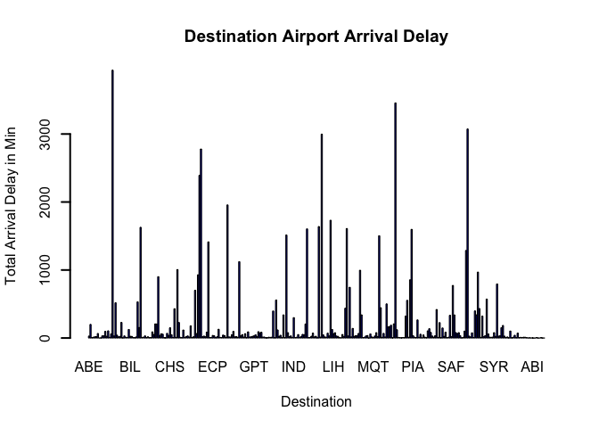

    No_Flght_Dest <- count(data$DEST)
    print(No_Flght_Dest)

    ##       x   freq
    ## 1   ABE   2320
    ## 2   ABQ  18808
    ## 3   ABR    735
    ## 4   ABY    997
    ## 5   ACT   1379
    ## 6   ACV   1348
    ## 7   ACY   3617
    ## 8   ADK    101
    ## 9   ADQ    523
    ## 10  AEX   2812
    ## 11  AGS   2621
    ## 12  ALB   9259
    ## 13  AMA   3028
    ## 14  ANC  17108
    ## 15  APN    622
    ## 16  ASE   4306
    ## 17  ATL 381166
    ## 18  ATW   3313
    ## 19  AUS  45846
    ## 20  AVL   3330
    ## 21  AVP   1627
    ## 22  AZO   2011
    ## 23  BDL  20118
    ## 24  BET    958
    ## 25  BFL   2568
    ## 26  BGM    872
    ## 27  BGR    597
    ## 28  BHM  12134
    ## 29  BIL   3371
    ## 30  BIS   2333
    ## 31  BJI    724
    ## 32  BLI    598
    ## 33  BMI   1503
    ## 34  BNA  50986
    ## 35  BOI  14614
    ## 36  BOS 119606
    ## 37  BPT    525
    ## 38  BQK   1016
    ## 39  BQN   1832
    ## 40  BRD    627
    ## 41  BRO   1994
    ## 42  BRW    908
    ## 43  BTM    661
    ## 44  BTR   6763
    ## 45  BTV   3925
    ## 46  BUF  17682
    ## 47  BUR  22136
    ## 48  BWI  94377
    ## 49  BZN   4214
    ## 50  CAE   4362
    ## 51  CAK   5214
    ## 52  CDC    624
    ## 53  CDV    711
    ## 54  CHA   4551
    ## 55  CHO   2349
    ## 56  CHS  14331
    ## 57  CID   4383
    ## 58  CIU    673
    ## 59  CLE  33588
    ## 60  CLL   1112
    ## 61  CLT 109058
    ## 62  CMH  22854
    ## 63  CMX    684
    ## 64  COD    905
    ## 65  COS   8162
    ## 66  CPR   1457
    ## 67  CRP   2909
    ## 68  CRW   2478
    ## 69  CSG   1224
    ## 70  CVG  15342
    ## 71  CWA    780
    ## 72  DAB   1958
    ## 73  DAL  67888
    ## 74  DAY   6357
    ## 75  DCA  75909
    ## 76  DEN 222121
    ## 77  DFW 192799
    ## 78  DHN   1365
    ## 79  DLH   2408
    ## 80  DRO   1926
    ## 81  DSM   7694
    ## 82  DTW 123055
    ## 83  DVL    567
    ## 84  EAU    659
    ## 85  ECP   4470
    ## 86  EGE   1672
    ## 87  EKO    626
    ## 88  ELM   1821
    ## 89  ELP  11258
    ## 90  ERI    713
    ## 91  ESC    610
    ## 92  EUG   3475
    ## 93  EVV   2689
    ## 94  EWN    694
    ## 95  EWR 112493
    ## 96  EYW   1731
    ## 97  FAI   2462
    ## 98  FAR   3891
    ## 99  FAT   8252
    ## 100 FAY   1673
    ## 101 FCA   2349
    ## 102 FLG   1808
    ## 103 FLL  82058
    ## 104 FNT   3807
    ## 105 FSD   4149
    ## 106 FSM   1149
    ## 107 FWA   4135
    ## 108 GCC   1017
    ## 109 GEG   9991
    ## 110 GFK   1535
    ## 111 GJT   2896
    ## 112 GNV   2263
    ## 113 GPT   3092
    ## 114 GRB   3661
    ## 115 GRK   1910
    ## 116 GRR   9055
    ## 117 GSO   5941
    ## 118 GSP   7020
    ## 119 GTF   1814
    ## 120 GTR   1006
    ## 121 GUC    236
    ## 122 GUM    366
    ## 123 HDN   1001
    ## 124 HIB    955
    ## 125 HLN   1669
    ## 126 HNL  47111
    ## 127 HOB    599
    ## 128 HOU  53287
    ## 129 HPN   6956
    ## 130 HRL   2939
    ## 131 HSV   4021
    ## 132 HYS    601
    ## 133 IAD  33860
    ## 134 IAG    385
    ## 135 IAH 134661
    ## 136 ICT   7759
    ## 137 IDA   2444
    ## 138 ILM   2538
    ## 139 IMT    659
    ## 140 IND  26522
    ## 141 INL    616
    ## 142 ISN   1616
    ## 143 ISP   4611
    ## 144 ITH    889
    ## 145 ITO   6130
    ## 146 JAC   3869
    ## 147 JAN   5137
    ## 148 JAX  18342
    ## 149 JFK  96161
    ## 150 JLN    425
    ## 151 JMS    883
    ## 152 JNU   4533
    ## 153 KOA  12186
    ## 154 KTN   2452
    ## 155 LAN   2370
    ## 156 LAR    598
    ## 157 LAS 149220
    ## 158 LAW   1122
    ## 159 LAX 210706
    ## 160 LBB   4505
    ## 161 LBE   1020
    ## 162 LCH   1237
    ## 163 LEX   5057
    ## 164 LFT   3040
    ## 165 LGA  93692
    ## 166 LGB  11060
    ## 167 LIH  11781
    ## 168 LIT   8297
    ## 169 LNK   2986
    ## 170 LRD   2083
    ## 171 LSE    750
    ## 172 LWS    710
    ## 173 MAF   5761
    ## 174 MBS   1943
    ## 175 MCI  43061
    ## 176 MCO 123884
    ## 177 MDT   2519
    ## 178 MDW  85933
    ## 179 MEI    981
    ## 180 MEM  13932
    ## 181 MFE   2189
    ## 182 MFR   2911
    ## 183 MGM   2432
    ## 184 MHT   6593
    ## 185 MIA  68684
    ## 186 MKE  32165
    ## 187 MKG    657
    ## 188 MLB   1503
    ## 189 MLI   2501
    ## 190 MLU   3012
    ## 191 MMH     95
    ## 192 MOB   4825
    ## 193 MOT   1612
    ## 194 MQT    675
    ## 195 MRY   2454
    ## 196 MSN   7387
    ## 197 MSO   2653
    ## 198 MSP 127989
    ## 199 MSY  43110
    ## 200 MTJ   1081
    ## 201 MYR   5609
    ## 202 OAJ   1243
    ## 203 OAK  48187
    ## 204 OGG  23217
    ## 205 OKC  15516
    ## 206 OMA  17710
    ## 207 OME    702
    ## 208 ONT  19426
    ## 209 ORD 238994
    ## 210 ORF  10833
    ## 211 ORH    699
    ## 212 OTH    284
    ## 213 OTZ    706
    ## 214 PAH    655
    ## 215 PBG    367
    ## 216 PBI  23955
    ## 217 PDX  58228
    ## 218 PHF   1113
    ## 219 PHL  72106
    ## 220 PHX 157495
    ## 221 PIA   2894
    ## 222 PIB    618
    ## 223 PIH    918
    ## 224 PIT  25034
    ## 225 PLN   1072
    ## 226 PNS   5905
    ## 227 PPG    120
    ## 228 PSC   3764
    ## 229 PSE    848
    ## 230 PSG    715
    ## 231 PSP   9897
    ## 232 PVD  12486
    ## 233 PWM   6206
    ## 234 RAP   2947
    ## 235 RDD    956
    ## 236 RDM   2720
    ## 237 RDU  34465
    ## 238 RHI   1017
    ## 239 RIC  15578
    ## 240 RKS    640
    ## 241 RNO  14000
    ## 242 ROA   2160
    ## 243 ROC   7208
    ## 244 ROW    435
    ## 245 RST   1200
    ## 246 RSW  28903
    ## 247 SAF   1186
    ## 248 SAN  77312
    ## 249 SAT  30553
    ## 250 SAV   7141
    ## 251 SBA   5869
    ## 252 SBN   5213
    ## 253 SBP   3128
    ## 254 SCC    812
    ## 255 SCE    723
    ## 256 SDF   9791
    ## 257 SEA 131831
    ## 258 SFO 169469
    ## 259 SGF   2742
    ## 260 SGU   2067
    ## 261 SHV   5853
    ## 262 SIT   1359
    ## 263 SJC  41668
    ## 264 SJU  26648
    ## 265 SLC 108234
    ## 266 SMF  40914
    ## 267 SMX    537
    ## 268 SNA  42156
    ## 269 SPI   1685
    ## 270 SRQ   3259
    ## 271 STL  54975
    ## 272 STT   4967
    ## 273 STX   1106
    ## 274 SUN   1117
    ## 275 SWF    716
    ## 276 SYR   5755
    ## 277 TLH   2543
    ## 278 TPA  67245
    ## 279 TRI   2144
    ## 280 TTN   2071
    ## 281 TUL  13843
    ## 282 TUS  15924
    ## 283 TVC   2165
    ## 284 TWF    987
    ## 285 TXK    828
    ## 286 TYR    412
    ## 287 TYS   7070
    ## 288 UST    191
    ## 289 VLD   1022
    ## 290 VPS   4160
    ## 291 WRG    718
    ## 292 XNA   5696
    ## 293 YAK    706
    ## 294 YUM   1958
    ## 295 GGG    367
    ## 296 SJT    985
    ## 297 SPS    819
    ## 298 ACK    606
    ## 299 HYA    121
    ## 300 MVY    248
    ## 301 WYS    224
    ## 302 ABI    158
    ## 303 AKN     63
    ## 304 DLG     84
    ## 305 GCK    418
    ## 306 GST     82
    ## 307 MHK      1
    ## 308 GRI    314
    ## 309 PGD     77
    ## 310 SPN      1

    plot(No_Flght_Dest$x, No_Flght_Dest$freq/1000,xlab="Destination Airport",ylab="Number of flights") 

Though due to large number of airorts, the information in the plots is
not clear. But we can still see that some airports have more arrival
delays. We can extend it to focus on just selected airports of interest
for more clarification and analysis.

**Impact of total flight time on arrival delays**

    Totalflightime_ArrDly <- tapply(data$ARR_DELAY_NEW, data$CRS_ELAPSED_TIME, sum)
    print(Totalflightime_ArrDly)

    ##      18      20      21      22      23      24      25      26      27 
    ##     195      16    1104     741    1494    1225     215     539     240 
    ##      28      29      30      31      32      33      34      35      36 
    ##      30     528     831    3351    6420   13655   15910   24978   10343 
    ##      37      38      39      40      41      42      43      44      45 
    ##   22707   10913   19675   31173   23820   24379   44319   33022   66646 
    ##      46      47      48      49      50      51      52      53      54 
    ##   44048   84436   58582   65932  200760   75992  119456  143094  147658 
    ##      55      56      57      58      59      60      61      62      63 
    ##  337127  136479  164265  174088  161703  708155  172398  223509  246400 
    ##      64      65      66      67      68      69      70      71      72 
    ##  225744  939892  256028  236318  234960  248832 1035026  244164  275765 
    ##      73      74      75      76      77      78      79      80      81 
    ##  270952  297583 1092701  283673  337859  324885  330226 1310637  316262 
    ##      82      83      84      85      86      87      88      89      90 
    ##  324994  309671  373871 1334066  369108  363244  370160  413438 1087106 
    ##      91      92      93      94      95      96      97      98      99 
    ##  364347  365638  337769  381628  777526  333315  309094  345976  344233 
    ##     100     101     102     103     104     105     106     107     108 
    ##  765902  334751  292206  317451  300941  708274  280023  297130  326075 
    ##     109     110     111     112     113     114     115     116     117 
    ##  289067  809103  301167  295112  336108  327558  804949  320429  284974 
    ##     118     119     120     121     122     123     124     125     126 
    ##  275348  335852  815065  299723  287306  276640  279798  702005  239978 
    ##     127     128     129     130     131     132     133     134     135 
    ##  285418  285260  286171  706492  261655  257525  292683  283710  692689 
    ##     136     137     138     139     140     141     142     143     144 
    ##  202911  245702  239085  231082  708539  225672  252060  242918  248050 
    ##     145     146     147     148     149     150     151     152     153 
    ##  648868  239757  239519  230925  274122  690926  221516  239133  219754 
    ##     154     155     156     157     158     159     160     161     162 
    ##  272638  722357  258301  297706  275252  305317  724338  259158  276105 
    ##     163     164     165     166     167     168     169     170     171 
    ##  293251  288081  600608  261332  247739  273944  243867  566012  255088 
    ##     172     173     174     175     176     177     178     179     180 
    ##  258154  255755  287458  487155  236775  206072  229834  276844  444899 
    ##     181     182     183     184     185     186     187     188     189 
    ##  220084  201558  189589  203289  385370  158686  151633  149359  157599 
    ##     190     191     192     193     194     195     196     197     198 
    ##  266286  152816  129617  125635  148468  280272  109832  123201  133821 
    ##     199     200     201     202     203     204     205     206     207 
    ##  111211  281762  124693  108962   92181  106353  260012   99667   79372 
    ##     208     209     210     211     212     213     214     215     216 
    ##  106986  102697  226941   89768   89470   86708   91994  200441   73731 
    ##     217     218     219     220     221     222     223     224     225 
    ##   64628   80440   85399  202708   78181   77670   79766   78720  196120 
    ##     226     227     228     229     230     231     232     233     234 
    ##   82967   85869   83764   89195  211374   81639   86910   80961   87130 
    ##     235     236     237     238     239     240     241     242     243 
    ##  211970   73861   73802   81228   80876  192924   81541   66063   60371 
    ##     244     245     246     247     248     249     250     251     252 
    ##   74543  152806   67583   73757   61601   86011  170282   78367   62309 
    ##     253     254     255     256     257     258     259     260     261 
    ##   54793   57823  132362   52708   47795   69682   51196  141258   69226 
    ##     262     263     264     265     266     267     268     269     270 
    ##   47305   48996   72783  133374   52610   54649   62407   70680  130589 
    ##     271     272     273     274     275     276     277     278     279 
    ##   46994   45191   48258   45753  132432   42626   58615   44892   42009 
    ##     280     281     282     283     284     285     286     287     288 
    ##  121871   44857   47889   41533   40009   86195   34479   26180   29719 
    ##     289     290     291     292     293     294     295     296     297 
    ##   34841   93018   37992   37131   29241   31048   68482   29814   33845 
    ##     298     299     300     301     302     303     304     305     306 
    ##   37384   37604  104238   32514   25989   37286   40881   64997   30958 
    ##     307     308     309     310     311     312     313     314     315 
    ##   50775   29722   42138   88804   46652   33780   44494   59265   96663 
    ##     316     317     318     319     320     321     322     323     324 
    ##   45003   38763   53131   52933  101222   43759   46561   49114   48570 
    ##     325     326     327     328     329     330     331     332     333 
    ##  108670   42102   50296   51049   77433  127055   43986   40389   36455 
    ##     334     335     336     337     338     339     340     341     342 
    ##   48250  103780   39939   43162   32581   41114   81351   36904   29847 
    ##     343     344     345     346     347     348     349     350     351 
    ##   30729   39128   62442   27215   33581   36767   28430   65448   21871 
    ##     352     353     354     355     356     357     358     359     360 
    ##   36673   28577   24736   61586   27817   21705   33152   34743   56191 
    ##     361     362     363     364     365     366     367     368     369 
    ##   27808   16694   29309   19910   48169   27110   13570   19935   21392 
    ##     370     371     372     373     374     375     376     377     378 
    ##   44909   20652   15626   28102   21939   51399   29683   32033   23041 
    ##     379     380     381     382     383     384     385     386     387 
    ##   23065   49217   18582   23968   22509   13196   58442   26976   18216 
    ##     388     389     390     391     392     393     394     395     396 
    ##   16610   17500   40183   17783   10064   12959   14816   30548    7330 
    ##     397     398     399     400     401     402     403     404     405 
    ##   10298    7861   13601   28662    6640    5918    9410   16733   27161 
    ##     406     407     408     409     410     411     412     413     414 
    ##    8572    7981    3797    8166    9850    6880    6474    4813    2427 
    ##     415     416     417     418     419     420     421     422     423 
    ##    1760    2212     574    3087     230     467    1957    1564     627 
    ##     424     425     426     427     428     429     430     432     433 
    ##     745    4825      56     671     478     524    2484    1546     179 
    ##     434     435     436     437     438     439     440     441     442 
    ##      22       0     271     688     959     359    1049     281    2028 
    ##     443     444     445     446     447     448     449     450     451 
    ##    2473       6    1296       8     693    3432       5     646    1230 
    ##     452     453     454     455     456     457     459     460     461 
    ##     335       2      53    2200    1388     629      15    2946     885 
    ##     462     463     464     465     466     467     468     469     470 
    ##     492    2065    1530    1114     754       0       0     963    1735 
    ##     471     472     473     474     475     476     477     480     482 
    ##     175      47       0     274     924     379       1    1410       2 
    ##     484     485     486     488     489     490     493     494     495 
    ##    1816    1602     211    1419     359     594    1255     252    1120 
    ##     496     497     499     500     503     504     505     506     507 
    ##    2350    1106    3236    1374     661    2987    2211     595    1459 
    ##     508     509     510     511     512     513     514     515     516 
    ##    3472     291     745    1745      29    2304    3194     921     681 
    ##     517     518     519     520     521     523     524     525     526 
    ##    1756     846    1744    2239    2962     148    3501     266      34 
    ##     527     528     529     530     531     532     534     535     537 
    ##    1511      17     475     424     456       0       0     138     131 
    ##     542     544     545     546     548     549     552     555     558 
    ##       0    1048    1075    1707     109       0      74      36     297 
    ##     559     560     562     564     565     569     570     571     573 
    ##      42    1583     277     995     409     459    2361     183     531 
    ##     574     575     576     577     578     579     580     581     583 
    ##     179     834      87       4     296      95     147     668       0 
    ##     584     585     586     587     588     589     591     593     595 
    ##     104    2279     191    1177     214     137      92      88     249 
    ##     604     606     610     611     613     614     615     616     617 
    ##      21     150     201      55     412     776     162      88     109 
    ##     618     625     627     633     644     646     647     650     654 
    ##    1122     552      51      75     154     846    1254    1194    1095 
    ##     655     660     665     670     672     675     676     679     683 
    ##     151     188      91     504     791    2581     354     244     781 
    ##     685     686     695     698     700     704     705 
    ##     505     303     325      37     207     285      13

    barplot(Totalflightime_ArrDly/1000, lwd = 2, col = "Darkblue",main = "Sceduled total flight time Arrival Delay", xlab = "Estimated flight time", ylab = "Total Arrival Delay in Min")

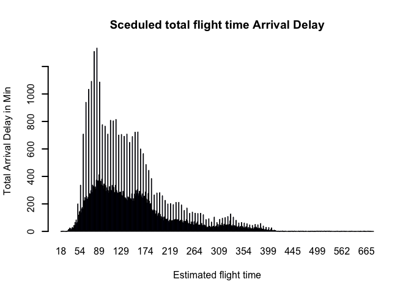

The short flight times have more arrival delays than long flights.

**Impact of departure time and Arrival time**

    data$CRS_DEP_TIME <-  floor(data$CRS_DEP_TIME/100)
    Departure_ArrDly <- tapply(data$ARR_DELAY_NEW, data$CRS_DEP_TIME, sum)
    print(Departure_ArrDly)

    ##       0       1       2       3       4       5       6       7       8 
    ##  159187   54292   23204   11293    5038  800396 2414652 2698769 2841194 
    ##       9      10      11      12      13      14      15      16      17 
    ## 2887895 3175845 3367819 3592654 4024412 4109817 4745656 4790652 5987468 
    ##      18      19      20      21      22      23 
    ## 5411569 5132296 4413057 2544462 1793364  626852

    barplot(Departure_ArrDly/1000, lwd = 2, col = "Darkblue",main = "Arrival Delay due to scheduled Departure Time", xlab = "Scheduled departure time", ylab = "Total Arrival Delay in Min")

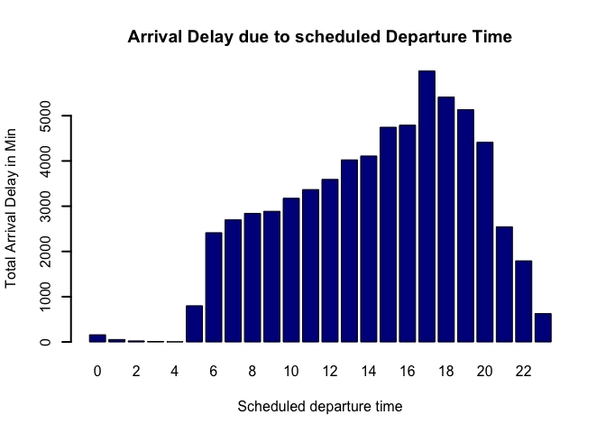

    data$CRS_ARR_TIME <-  floor(data$CRS_ARR_TIME/100)
    Arr_ArrDly <- tapply(data$ARR_DELAY_NEW, data$CRS_ARR_TIME, sum)
    print(Arr_ArrDly)

    ##       0       1       2       3       4       5       6       7       8 
    ## 1305167  251036   38597   32245   88196  492087  729595 1287390 1823558 
    ##       9      10      11      12      13      14      15      16      17 
    ## 2344465 2487896 2734084 2769263 3036395 3393531 3482398 4638051 4607428 
    ##      18      19      20      21      22      23      24 
    ## 5139122 5356086 5545249 5791838 4547127 3690393     646

    barplot(Arr_ArrDly/1000, lwd = 2, col = "Darkblue",main = "Arrival Delay due to scheduled Arrival Time", xlab = "Scheduled arrival time", ylab = "Total Arrival Delay in Min")

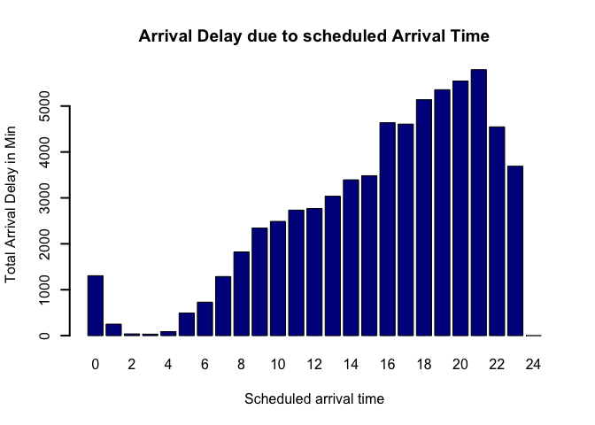

The highest peak for departure time is around 17 -19 and for arrival
time is around 19 - 21 hrs on 24 hour time scale. The early morning
flights have very less arrival delays.

**Total number of flights for scheduled departure and arrival time**

    No_Flght_DepTime <- count(data$CRS_DEP_TIME)
    print(No_Flght_DepTime)

    ##     x   freq
    ## 1   0  16089
    ## 2   1   5664
    ## 3   2   1680
    ## 4   3    952
    ## 5   4    508
    ## 6   5 125625
    ## 7   6 381485
    ## 8   7 377423
    ## 9   8 363129
    ## 10  9 341563
    ## 11 10 342628
    ## 12 11 346682
    ## 13 12 330386
    ## 14 13 340015
    ## 15 14 311143
    ## 16 15 338705
    ## 17 16 315804
    ## 18 17 367894
    ## 19 18 316014
    ## 20 19 305426
    ## 21 20 257582
    ## 22 21 169977
    ## 23 22 133072
    ## 24 23  48699

    plot(No_Flght_DepTime$x, No_Flght_DepTime$freq/1000,xlab="Departure Time Airport",ylab="Number of flights") 

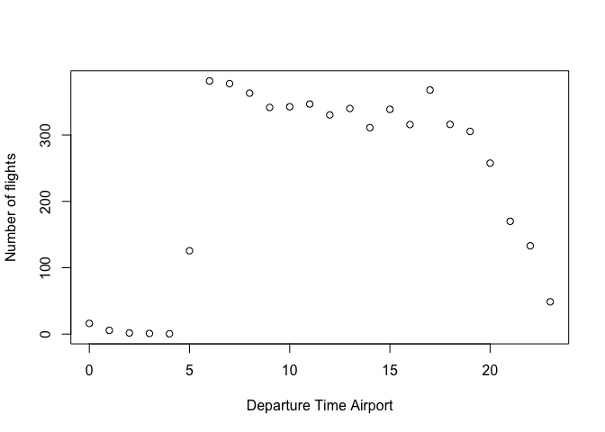

    No_Flght_ArrTime <- count(data$CRS_ARR_TIME)
    print(No_Flght_ArrTime)

    ##     x   freq
    ## 1   0  80314
    ## 2   1  15075
    ## 3   2   3108
    ## 4   3   1824
    ## 5   4   7330
    ## 6   5  42438
    ## 7   6  86549
    ## 8   7 192139
    ## 9   8 265115
    ## 10  9 324139
    ## 11 10 333611
    ## 12 11 328619
    ## 13 12 325594
    ## 14 13 329746
    ## 15 14 334288
    ## 16 15 307880
    ## 17 16 375668
    ## 18 17 329243
    ## 19 18 339436
    ## 20 19 329007
    ## 21 20 335025
    ## 22 21 344976
    ## 23 22 270756
    ## 24 23 236250
    ## 25 24     15

    plot(No_Flght_ArrTime$x, No_Flght_ArrTime$freq/1000,xlab="Arrival Time Airport",ylab="Number of flights") 

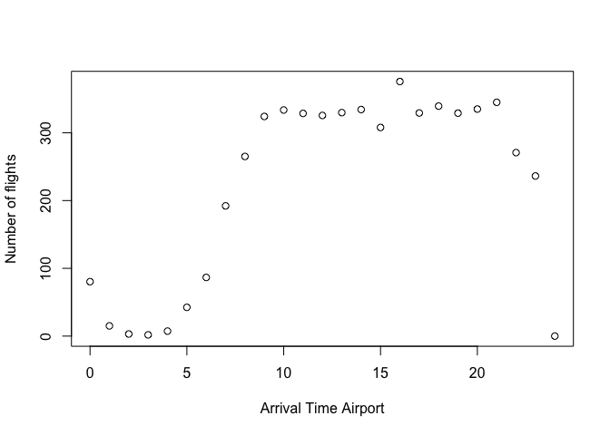

    ArrDly <- tapply(data$ARR_DELAY_NEW, data$DISTANCE,sum)
    barplot(ArrDly/1000, lwd = 2,main = "Arrival Delay due to Distance", xlab = "Distance", ylab = "Total Arrival Delay in Min")

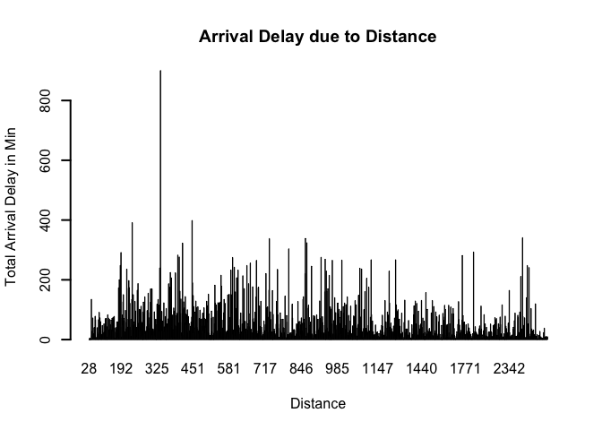

**Plots of Total number of delays( greater or equal to 15 mins) as per
month, day of the week, origin, destination, carrier, distance,
departure and arrival times.**

    library(plyr)
    ArrDly_15min <- subset(data, ARR_DELAY_NEW >= 15, select = c(CARRIER, MONTH, DAY_OF_WEEK, ORIGIN, DEST, DISTANCE, CRS_DEP_TIME, CRS_ARR_TIME))

    ArrDly_15min_Month <- count(ArrDly_15min$MONTH)
    print(ArrDly_15min_Month)

    ##     x   freq
    ## 1   1  70882
    ## 2   2  61680
    ## 3   3  82569
    ## 4   4  66607
    ## 5   5  75498
    ## 6   6 100361
    ## 7   7 113601
    ## 8   8 103421
    ## 9   9  63686
    ## 10 10  63470
    ## 11 11  58871
    ## 12 12 103593

    plot(ArrDly_15min_Month$x,ArrDly_15min_Month$freq/1000,xlab="Months",ylab="Total arrival delays")

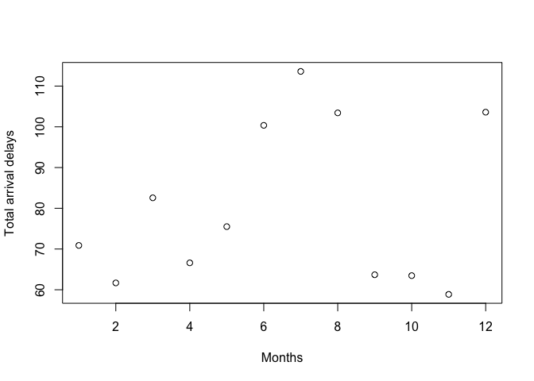

    ArrDly_15min_Dy <- count(ArrDly_15min$DAY_OF_WEEK)
    print(ArrDly_15min_Dy)

    ##   x   freq
    ## 1 1 144435
    ## 2 2 130434
    ## 3 3 130750
    ## 4 4 160151
    ## 5 5 162460
    ## 6 6 101999
    ## 7 7 134010

    plot(ArrDly_15min_Dy$x,ArrDly_15min_Dy$freq/1000,xlab="Months",ylab="Total arrival delays")

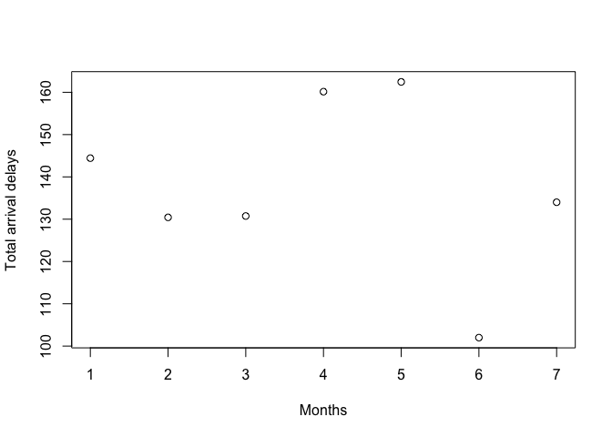

    ArrDly_15min_Carrier <- count(ArrDly_15min$CARRIER)
    ArrDly_15min_Carrier

    ##     x   freq
    ## 1  AA 175453
    ## 2  AS  21196
    ## 3  B6  66137
    ## 4  DL 118938
    ## 5  EV  85667
    ## 6  F9  21484
    ## 7  HA   6648
    ## 8  NK  32659
    ## 9  OO  97028
    ## 10 UA  92841
    ## 11 VX  15577
    ## 12 WN 230611

    plot(ArrDly_15min_Carrier$x,ArrDly_15min_Carrier$freq/1000,xlab="Carrier",ylab="Total arrival delays")

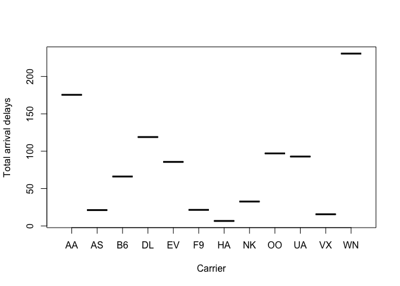

    ArrDly_15min_Distance <- count(ArrDly_15min$DISTANCE)
    plot(ArrDly_15min_Distance$x,ArrDly_15min_Distance$freq/1000,xlab="Distance",ylab="Total arrival delays")

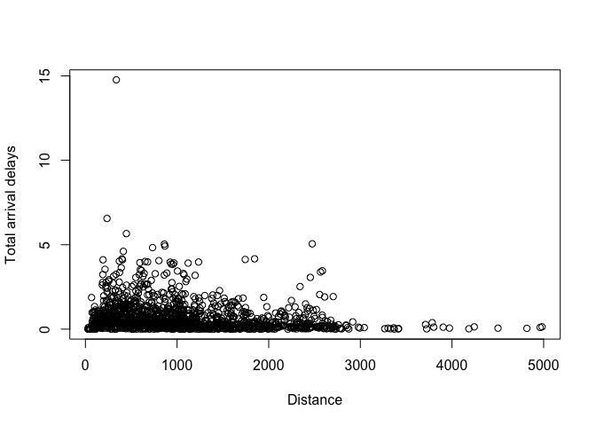

    ArrDly_15min_Origin <- count(ArrDly_15min$ORIGIN)
     ArrDly_15min_Origin 

    ##       x  freq
    ## 1   ABE   346
    ## 2   ABQ  3082
    ## 3   ABR    87
    ## 4   ABY   126
    ## 5   ACT   213
    ## 6   ACV   303
    ## 7   ACY   803
    ## 8   ADK    20
    ## 9   ADQ    44
    ## 10  AEX   445
    ## 11  AGS   369
    ## 12  ALB  1217
    ## 13  AMA   321
    ## 14  ANC  1597
    ## 15  APN    89
    ## 16  ASE   959
    ## 17  ATL 55936
    ## 18  ATW   428
    ## 19  AUS  7171
    ## 20  AVL   576
    ## 21  AVP   229
    ## 22  AZO   312
    ## 23  BDL  2865
    ## 24  BET    60
    ## 25  BFL   288
    ## 26  BGM   130
    ## 27  BGR   119
    ## 28  BHM  1720
    ## 29  BIL   290
    ## 30  BIS   285
    ## 31  BJI    81
    ## 32  BLI    60
    ## 33  BMI   237
    ## 34  BNA  8703
    ## 35  BOI  2101
    ## 36  BOS 21619
    ## 37  BPT   122
    ## 38  BQK   152
    ## 39  BQN   392
    ## 40  BRD    79
    ## 41  BRO   202
    ## 42  BRW    78
    ## 43  BTM    47
    ## 44  BTR  1183
    ## 45  BTV   761
    ## 46  BUF  2464
    ## 47  BUR  3708
    ## 48  BWI 15741
    ## 49  BZN   528
    ## 50  CAE   699
    ## 51  CAK   777
    ## 52  CDC    59
    ## 53  CDV    72
    ## 54  CHA   736
    ## 55  CHO   399
    ## 56  CHS  2239
    ## 57  CID   633
    ## 58  CIU    94
    ## 59  CLE  5420
    ## 60  CLL   125
    ## 61  CLT 19592
    ## 62  CMH  3403
    ## 63  CMX   134
    ## 64  COD   109
    ## 65  COS  1414
    ## 66  CPR   133
    ## 67  CRP   322
    ## 68  CRW   489
    ## 69  CSG   193
    ## 70  CVG  2391
    ## 71  CWA   112
    ## 72  DAB   238
    ## 73  DAL 13973
    ## 74  DAY   880
    ## 75  DCA 13396
    ## 76  DEN 40013
    ## 77  DFW 40922
    ## 78  DHN   222
    ## 79  DLH   405
    ## 80  DRO   344
    ## 81  DSM  1129
    ## 82  DTW 19415
    ## 83  DVL    68
    ## 84  EAU    69
    ## 85  ECP   508
    ## 86  EGE   282
    ## 87  EKO    55
    ## 88  ELM   210
    ## 89  ELP  1738
    ## 90  ERI   118
    ## 91  ESC    83
    ## 92  EUG   680
    ## 93  EVV   443
    ## 94  EWN    99
    ## 95  EWR 24028
    ## 96  EYW   170
    ## 97  FAI   261
    ## 98  FAR   584
    ## 99  FAT  1360
    ## 100 FAY   228
    ## 101 FCA   237
    ## 102 FLG   210
    ## 103 FLL 17199
    ## 104 FNT   401
    ## 105 FSD   648
    ## 106 FSM   140
    ## 107 FWA   634
    ## 108 GCC    77
    ## 109 GEG  1173
    ## 110 GFK   178
    ## 111 GJT   234
    ## 112 GNV   353
    ## 113 GPT   395
    ## 114 GRB   473
    ## 115 GRK   199
    ## 116 GRR  1278
    ## 117 GSO   932
    ## 118 GSP  1032
    ## 119 GTF   159
    ## 120 GTR   152
    ## 121 GUC    40
    ## 122 GUM    50
    ## 123 HDN   164
    ## 124 HIB   167
    ## 125 HLN    99
    ## 126 HNL  4028
    ## 127 HOB    65
    ## 128 HOU 10080
    ## 129 HPN  1524
    ## 130 HRL   402
    ## 131 HSV   429
    ## 132 HYS    79
    ## 133 IAD  5314
    ## 134 IAG    79
    ## 135 IAH 21563
    ## 136 ICT   982
    ## 137 IDA   245
    ## 138 ILM   304
    ## 139 IMT    70
    ## 140 IND  3997
    ## 141 INL   102
    ## 142 ISN   166
    ## 143 ISP   566
    ## 144 ITH   161
    ## 145 ITO   499
    ## 146 JAC   709
    ## 147 JAN   640
    ## 148 JAX  2623
    ## 149 JFK 21135
    ## 150 JLN    58
    ## 151 JMS   107
    ## 152 JNU   456
    ## 153 KOA  1259
    ## 154 KTN   261
    ## 155 LAN   376
    ## 156 LAR    57
    ## 157 LAS 29308
    ## 158 LAW   174
    ## 159 LAX 47328
    ## 160 LBB   535
    ## 161 LBE   200
    ## 162 LCH   131
    ## 163 LEX   827
    ## 164 LFT   412
    ## 165 LGA 20319
    ## 166 LGB  2021
    ## 167 LIH   989
    ## 168 LIT  1043
    ## 169 LNK   371
    ## 170 LRD   267
    ## 171 LSE    82
    ## 172 LWS    33
    ## 173 MAF   636
    ## 174 MBS   301
    ## 175 MCI  6306
    ## 176 MCO 22385
    ## 177 MDT   356
    ## 178 MDW 14934
    ## 179 MEI   197
    ## 180 MEM  1970
    ## 181 MFE   251
    ## 182 MFR   519
    ## 183 MGM   390
    ## 184 MHT   753
    ## 185 MIA 16343
    ## 186 MKE  4696
    ## 187 MKG   132
    ## 188 MLB   167
    ## 189 MLI   340
    ## 190 MLU   472
    ## 191 MMH    22
    ## 192 MOB   791
    ## 193 MOT   214
    ## 194 MQT   115
    ## 195 MRY   414
    ## 196 MSN   948
    ## 197 MSO   283
    ## 198 MSP 20918
    ## 199 MSY  6706
    ## 200 MTJ   169
    ## 201 MYR  1060
    ## 202 OAJ   191
    ## 203 OAK  9552
    ## 204 OGG  2475
    ## 205 OKC  2039
    ## 206 OMA  2386
    ## 207 OME    88
    ## 208 ONT  3172
    ## 209 ORD 52820
    ## 210 ORF  1620
    ## 211 ORH   179
    ## 212 OTH    98
    ## 213 OTZ    66
    ## 214 PAH    99
    ## 215 PBG    73
    ## 216 PBI  4849
    ## 217 PDX  7982
    ## 218 PHF   126
    ## 219 PHL 13800
    ## 220 PHX 27437
    ## 221 PIA   462
    ## 222 PIB   102
    ## 223 PIH   101
    ## 224 PIT  3111
    ## 225 PLN   141
    ## 226 PNS   695
    ## 227 PPG    21
    ## 228 PSC   478
    ## 229 PSE   121
    ## 230 PSG    87
    ## 231 PSP  1760
    ## 232 PVD  1628
    ## 233 PWM  1104
    ## 234 RAP   367
    ## 235 RDD   188
    ## 236 RDM   494
    ## 237 RDU  5747
    ## 238 RHI   148
    ## 239 RIC  2874
    ## 240 RKS    49
    ## 241 RNO  2430
    ## 242 ROA   363
    ## 243 ROC  1052
    ## 244 ROW    72
    ## 245 RST   162
    ## 246 RSW  4662
    ## 247 SAF   290
    ## 248 SAN 12619
    ## 249 SAT  4475
    ## 250 SAV  1272
    ## 251 SBA  1137
    ## 252 SBN   898
    ## 253 SBP   560
    ## 254 SCC    55
    ## 255 SCE   133
    ## 256 SDF  1426
    ## 257 SEA 20210
    ## 258 SFO 36859
    ## 259 SGF   410
    ## 260 SGU   191
    ## 261 SHV   933
    ## 262 SIT   124
    ## 263 SJC  7179
    ## 264 SJU  4556
    ## 265 SLC 14412
    ## 266 SMF  7279
    ## 267 SMX   108
    ## 268 SNA  6439
    ## 269 SPI   266
    ## 270 SRQ   532
    ## 271 STL  9690
    ## 272 STT   797
    ## 273 STX   170
    ## 274 SUN   173
    ## 275 SWF   150
    ## 276 SYR   945
    ## 277 TLH   307
    ## 278 TPA 10731
    ## 279 TRI   303
    ## 280 TTN   369
    ## 281 TUL  1749
    ## 282 TUS  2454
    ## 283 TVC   356
    ## 284 TWF   129
    ## 285 TXK   159
    ## 286 TYR    32
    ## 287 TYS  1144
    ## 288 UST    39
    ## 289 VLD   143
    ## 290 VPS   535
    ## 291 WRG    95
    ## 292 XNA   839
    ## 293 YAK    50
    ## 294 YUM   184
    ## 295 GGG    90
    ## 296 SJT   201
    ## 297 SPS   126
    ## 298 ACK   128
    ## 299 HYA    20
    ## 300 MVY    77
    ## 301 WYS    29
    ## 302 ABI    37
    ## 303 AKN    14
    ## 304 DLG    12
    ## 305 GCK    83
    ## 306 GST    15
    ## 307 GRI    74
    ## 308 EFD     1
    ## 309 PGD    12
    ## 310 SPN     1

    plot(ArrDly_15min_Origin$x,ArrDly_15min_Origin$freq/1000,xlab="origin Airport",ylab="Total arrival delays")

    ArrDly_15min_Dest <- count(ArrDly_15min$DEST)
    print(ArrDly_15min_Dest)

    ##       x  freq
    ## 1   ABE   417
    ## 2   ABQ  3382
    ## 3   ABR    69
    ## 4   ABY   180
    ## 5   ACT   260
    ## 6   ACV   305
    ## 7   ACY   890
    ## 8   ADK    14
    ## 9   ADQ    31
    ## 10  AEX   449
    ## 11  AGS   451
    ## 12  ALB  1530
    ## 13  AMA   488
    ## 14  ANC  1884
    ## 15  APN   100
    ## 16  ASE   945
    ## 17  ATL 49607
    ## 18  ATW   503
    ## 19  AUS  8283
    ## 20  AVL   579
    ## 21  AVP   249
    ## 22  AZO   287
    ## 23  BDL  3609
    ## 24  BET    55
    ## 25  BFL   437
    ## 26  BGM   142
    ## 27  BGR   118
    ## 28  BHM  1944
    ## 29  BIL   437
    ## 30  BIS   352
    ## 31  BJI    82
    ## 32  BLI    74
    ## 33  BMI   243
    ## 34  BNA  8498
    ## 35  BOI  2482
    ## 36  BOS 25004
    ## 37  BPT   109
    ## 38  BQK   179
    ## 39  BQN   506
    ## 40  BRD    50
    ## 41  BRO   258
    ## 42  BRW    67
    ## 43  BTM    39
    ## 44  BTR  1241
    ## 45  BTV   803
    ## 46  BUF  3047
    ## 47  BUR  3694
    ## 48  BWI 14273
    ## 49  BZN   595
    ## 50  CAE   831
    ## 51  CAK   870
    ## 52  CDC    84
    ## 53  CDV    51
    ## 54  CHA   845
    ## 55  CHO   510
    ## 56  CHS  2274
    ## 57  CID   690
    ## 58  CIU    83
    ## 59  CLE  5936
    ## 60  CLL   151
    ## 61  CLT 15678
    ## 62  CMH  3735
    ## 63  CMX   131
    ## 64  COD    59
    ## 65  COS  1676
    ## 66  CPR   133
    ## 67  CRP   420
    ## 68  CRW   431
    ## 69  CSG   223
    ## 70  CVG  2400
    ## 71  CWA   120
    ## 72  DAB   269
    ## 73  DAL 11721
    ## 74  DAY  1043
    ## 75  DCA 14478
    ## 76  DEN 34641
    ## 77  DFW 34736
    ## 78  DHN   280
    ## 79  DLH   385
    ## 80  DRO   255
    ## 81  DSM  1312
    ## 82  DTW 17017
    ## 83  DVL    74
    ## 84  EAU    98
    ## 85  ECP   626
    ## 86  EGE   337
    ## 87  EKO    43
    ## 88  ELM   271
    ## 89  ELP  2244
    ## 90  ERI   115
    ## 91  ESC    91
    ## 92  EUG   602
    ## 93  EVV   437
    ## 94  EWN   139
    ## 95  EWR 26067
    ## 96  EYW   208
    ## 97  FAI   271
    ## 98  FAR   638
    ## 99  FAT  1367
    ## 100 FAY   245
    ## 101 FCA   288
    ## 102 FLG   193
    ## 103 FLL 17141
    ## 104 FNT   506
    ## 105 FSD   715
    ## 106 FSM   206
    ## 107 FWA   764
    ## 108 GCC    86
    ## 109 GEG  1536
    ## 110 GFK   203
    ## 111 GJT   257
    ## 112 GNV   385
    ## 113 GPT   420
    ## 114 GRB   610
    ## 115 GRK   295
    ## 116 GRR  1410
    ## 117 GSO   994
    ## 118 GSP  1218
    ## 119 GTF   203
    ## 120 GTR   203
    ## 121 GUC    51
    ## 122 GUM    71
    ## 123 HDN   182
    ## 124 HIB   115
    ## 125 HLN   181
    ## 126 HNL  6161
    ## 127 HOB    69
    ## 128 HOU  9688
    ## 129 HPN  1709
    ## 130 HRL   459
    ## 131 HSV   570
    ## 132 HYS    67
    ## 133 IAD  4967
    ## 134 IAG    68
    ## 135 IAH 19908
    ## 136 ICT  1204
    ## 137 IDA   252
    ## 138 ILM   405
    ## 139 IMT    82
    ## 140 IND  4691
    ## 141 INL    80
    ## 142 ISN   190
    ## 143 ISP   833
    ## 144 ITH   123
    ## 145 ITO   458
    ## 146 JAC   728
    ## 147 JAN   740
    ## 148 JAX  3209
    ## 149 JFK 21128
    ## 150 JLN    75
    ## 151 JMS    99
    ## 152 JNU   442
    ## 153 KOA  1198
    ## 154 KTN   287
    ## 155 LAN   392
    ## 156 LAR    60
    ## 157 LAS 26363
    ## 158 LAW   194
    ## 159 LAX 49065
    ## 160 LBB   747
    ## 161 LBE   214
    ## 162 LCH   157
    ## 163 LEX   842
    ## 164 LFT   432
    ## 165 LGA 24243
    ## 166 LGB  1972
    ## 167 LIH  1057
    ## 168 LIT  1250
    ## 169 LNK   453
    ## 170 LRD   298
    ## 171 LSE   117
    ## 172 LWS    35
    ## 173 MAF   881
    ## 174 MBS   307
    ## 175 MCI  7222
    ## 176 MCO 23476
    ## 177 MDT   425
    ## 178 MDW 12646
    ## 179 MEI   187
    ## 180 MEM  2265
    ## 181 MFE   344
    ## 182 MFR   537
    ## 183 MGM   430
    ## 184 MHT  1074
    ## 185 MIA 14145
    ## 186 MKE  5213
    ## 187 MKG   111
    ## 188 MLB   191
    ## 189 MLI   449
    ## 190 MLU   509
    ## 191 MMH    21
    ## 192 MOB   824
    ## 193 MOT   211
    ## 194 MQT    96
    ## 195 MRY   413
    ## 196 MSN  1138
    ## 197 MSO   352
    ## 198 MSP 19407
    ## 199 MSY  7296
    ## 200 MTJ   176
    ## 201 MYR   972
    ## 202 OAJ   217
    ## 203 OAK  9184
    ## 204 OGG  2740
    ## 205 OKC  2729
    ## 206 OMA  2973
    ## 207 OME    74
    ## 208 ONT  3583
    ## 209 ORD 44845
    ## 210 ORF  1791
    ## 211 ORH   140
    ## 212 OTH    96
    ## 213 OTZ    49
    ## 214 PAH   110
    ## 215 PBG    76
    ## 216 PBI  4938
    ## 217 PDX  9028
    ## 218 PHF   159
    ## 219 PHL 12982
    ## 220 PHX 26208
    ## 221 PIA   442
    ## 222 PIB   118
    ## 223 PIH    80
    ## 224 PIT  4170
    ## 225 PLN   149
    ## 226 PNS   879
    ## 227 PPG    14
    ## 228 PSC   628
    ## 229 PSE   222
    ## 230 PSG   102
    ## 231 PSP  1628
    ## 232 PVD  2102
    ## 233 PWM  1173
    ## 234 RAP   419
    ## 235 RDD   186
    ## 236 RDM   497
    ## 237 RDU  6403
    ## 238 RHI   111
    ## 239 RIC  3164
    ## 240 RKS    73
    ## 241 RNO  2562
    ## 242 ROA   339
    ## 243 ROC  1284
    ## 244 ROW    52
    ## 245 RST   191
    ## 246 RSW  5154
    ## 247 SAF   272
    ## 248 SAN 13077
    ## 249 SAT  5560
    ## 250 SAV  1192
    ## 251 SBA  1054
    ## 252 SBN   952
    ## 253 SBP   532
    ## 254 SCC    47
    ## 255 SCE   159
    ## 256 SDF  1621
    ## 257 SEA 21156
    ## 258 SFO 42671
    ## 259 SGF   415
    ## 260 SGU   249
    ## 261 SHV   998
    ## 262 SIT   145
    ## 263 SJC  7080
    ## 264 SJU  5360
    ## 265 SLC 13409
    ## 266 SMF  7597
    ## 267 SMX   149
    ## 268 SNA  6000
    ## 269 SPI   318
    ## 270 SRQ   532
    ## 271 STL  9376
    ## 272 STT   892
    ## 273 STX   226
    ## 274 SUN   159
    ## 275 SWF   199
    ## 276 SYR  1123
    ## 277 TLH   388
    ## 278 TPA 12243
    ## 279 TRI   345
    ## 280 TTN   390
    ## 281 TUL  2413
    ## 282 TUS  2972
    ## 283 TVC   408
    ## 284 TWF    89
    ## 285 TXK   186
    ## 286 TYR    42
    ## 287 TYS  1364
    ## 288 UST    28
    ## 289 VLD   177
    ## 290 VPS   610
    ## 291 WRG    97
    ## 292 XNA   955
    ## 293 YAK    69
    ## 294 YUM   177
    ## 295 GGG    82
    ## 296 SJT   194
    ## 297 SPS   150
    ## 298 ACK    91
    ## 299 HYA    12
    ## 300 MVY    53
    ## 301 WYS    23
    ## 302 ABI    33
    ## 303 AKN     5
    ## 304 DLG     6
    ## 305 GCK    73
    ## 306 GST     7
    ## 307 GRI    50
    ## 308 PGD     9

    plot(ArrDly_15min_Dest$x,ArrDly_15min_Dest$freq/1000,xlab="Destination Airport",ylab="Total arrival delays")

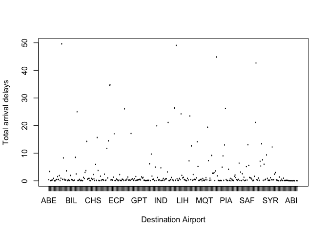

    ArrDly_15min_DepTime <- count(ArrDly_15min$CRS_DEP_TIME)
    print(ArrDly_15min_DepTime)

    ##     x  freq
    ## 1   0  2444
    ## 2   1   803
    ## 3   2   339
    ## 4   3   189
    ## 5   4    71
    ## 6   5  8480
    ## 7   6 30480
    ## 8   7 39243
    ## 9   8 42383
    ## 10  9 44793
    ## 11 10 48547
    ## 12 11 52124
    ## 13 12 53791
    ## 14 13 59873
    ## 15 14 61042
    ## 16 15 69003
    ## 17 16 69555
    ## 18 17 85478
    ## 19 18 78411
    ## 20 19 75308
    ## 21 20 65547
    ## 22 21 39062
    ## 23 22 27501
    ## 24 23  9772

    plot(ArrDly_15min_DepTime$x,ArrDly_15min_DepTime$freq/1000,xlab="Departure time",ylab="Total arrival delays")

    ArrDly_15min_ArrTime <- count(ArrDly_15min$CRS_ARR_TIME)
    print(ArrDly_15min_ArrTime)

    ##     x  freq
    ## 1   0 20129
    ## 2   1  3907
    ## 3   2   628
    ## 4   3   529
    ## 5   4  1232
    ## 6   5  7382
    ## 7   6  9358
    ## 8   7 15339
    ## 9   8 24626
    ## 10  9 33451
    ## 11 10 37571
    ## 12 11 40800
    ## 13 12 42532
    ## 14 13 46761
    ## 15 14 50963
    ## 16 15 52251
    ## 17 16 69013
    ## 18 17 68241
    ## 19 18 74916
    ## 20 19 76904
    ## 21 20 80038
    ## 22 21 84063
    ## 23 22 67152
    ## 24 23 56444
    ## 25 24     9

    plot(ArrDly_15min_ArrTime$x,ArrDly_15min_ArrTime$freq/1000,xlab="Arrival time",ylab="Total arrival delays")

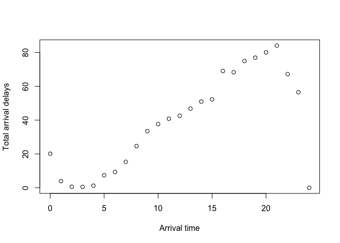

**PREDICTIVE MODELS FOR ARRIVAL DELAYS**

I have created two machine learning models to predict flight
arriaval delays using There are ways to predict flight arrival delay, in
this project instead of predicting the extent of delay, I opt to predict
the outcome classes according to whether a flight is delayed (1) or not
(0) as ARR\_DEL15 feature in the dataset is already there.

A flight is on-time if the departure delay is within 15 minutes of the
scheduled departure time (CRSDepTime).

A flight is delayed if the departure delay is more than 15 minutes late
from the scheduled departure time (CRSDepTime).

For flight departure delay prediction, the following features are
potential candidates for the model:

1.  Month
2.  Day of Week
3.  CRSDepartureTime
4.  CRSArrivalTime
5.  Departure Airport
6.  Arrival Airport
7.  CRSElapsedTime (total time for a flight)
8.  Flight Distance
9.  AirlineID 10.ArrDel15 as 0 and 1 values

<!-- -->

    #get rid of all categorical variables
    data[,c("CARRIER","ORIGIN","DEST","DEP_TIME","ARR_TIME","ARR_DELAY_NEW","ACTUAL_ELAPSED_TIME")] <- NULL

Since the dataset consists of around 5 million rows and the memory
restrictions for using R, I applied the algorithm on a random data
sample form this big dataset. Firstly i randomly shuffled the data and
then picked a subset of 198000 rows for modelling. The subset is equally
divided into training and testing sets(1:1). The classification
algorithms are applied on the training set first, and then the model is
subsequently tested on the testing sets to evaluate the prediction and
accuracy The analysis can be done by the confusion matrix which is a
useful tool to detect how well the classifier recognizes the tuples of
different classes. It shows the value of true positives, true negatives,
false positives and false negatives. Based on the error rates the
classifier accuracy can be calculated.

**K-NN ALGORITHM**

It is a simple supervised learning, nonparametric method used for
classification and regression. In both cases, the input consists of the
k closest training examples in the feature space. In k-NN
classification, the output is a class membership. An object is
classified by a majority vote of its neighbors, with the object being
assigned to the class most common among its k nearest neighbors (k is a
positive integer, typically small). If k = 1, then the object is simply
assigned to the class of that single nearest neighbor. Pick an odd k is
preferred as the odd vote can break the ties.

    #shuffling the data
    set.seed(1)
    shuff<-runif(nrow(data))
    data <- data[order(shuff),]

    #k-nn
    library(class)
    library(MASS)

    ## Warning: package 'MASS' was built under R version 3.3.2

    library(car)

    ## Warning: package 'car' was built under R version 3.3.2

    #training data set
    train_data <- data[1:90000,]

    #testing dataset
    test_data <- data[90001:180000,]

    train_target <- data[1:90000,c(8)]
    test_target<-data[90001:180000,c(8)]

    knn.m1 <- knn(train = train_data, test = test_data, train_target, k=10)
    length(knn.m1)

    ## [1] 90000

    #confusion matrix
    cm1 <- table(test_target,knn.m1)
    cm1

    ##            knn.m1
    ## test_target     0     1
    ##           0 72648  1521
    ##           1 15060   771

    #error rate
    1 - sum(diag(cm1))/sum(cm1)

    ## [1] 0.1842333

    library(caret) 

    ## Warning: package 'caret' was built under R version 3.3.2

    ## Loading required package: lattice

    ## Warning: package 'lattice' was built under R version 3.3.2

    ## Loading required package: ggplot2

    ## Warning: package 'ggplot2' was built under R version 3.3.2

    confusionMatrix(cm1)

    ## Confusion Matrix and Statistics
    ## 
    ##            knn.m1
    ## test_target     0     1
    ##           0 72648  1521
    ##           1 15060   771
    ##                                           
    ##                Accuracy : 0.8158          
    ##                  95% CI : (0.8132, 0.8183)
    ##     No Information Rate : 0.9745          
    ##     P-Value [Acc > NIR] : 1               
    ##                                           
    ##                   Kappa : 0.0425          
    ##  Mcnemar's Test P-Value : <2e-16          
    ##                                           
    ##             Sensitivity : 0.8283          
    ##             Specificity : 0.3364          
    ##          Pos Pred Value : 0.9795          
    ##          Neg Pred Value : 0.0487          
    ##              Prevalence : 0.9745          
    ##          Detection Rate : 0.8072          
    ##    Detection Prevalence : 0.8241          
    ##       Balanced Accuracy : 0.5823          
    ##                                           
    ##        'Positive' Class : 0               
    ## 

The k-nn algorithm did a good job in predicting the arrival delays. As
we can see the results above:

Accuracy : 82%

Senstivity = 83%

Specifity = 34%

**MODEL USING DECISION TREE ALGORITHM**

A decision tree is a decision support tool that uses a tree-like graph
or model of decisions and their outcomes. The decision tree can be
linearized into decision rules, where the outcome is the contents of the
leaf node, and the conditions along the path form a conjunction in the
if clause. In general, the rules have the form: If condition 1 and
condition2 and condition3 then outcome. Each node in the tree is a
decisions/tests. Each path from the tree root to a leaf corresponds to a
conjunction of attribute decisions/tests. The tree itself corresponds to
a disjunction of these conjunctions.

For Decison tree model, I have used the entire dataset. Dividing it into
training and testing sets(1:1).

    #Loadig packages
    library(C50)
    library(gmodels)
    library(rpart)

    ## Warning: package 'rpart' was built under R version 3.3.2

    library(RColorBrewer)
    library(tree)
    library(party)

    ## Warning: package 'party' was built under R version 3.3.2

    ## Loading required package: grid

    ## Loading required package: mvtnorm

    ## Warning: package 'mvtnorm' was built under R version 3.3.2

    ## Loading required package: modeltools

    ## Loading required package: stats4

    ## 
    ## Attaching package: 'modeltools'

    ## The following object is masked from 'package:plyr':
    ## 
    ##     empty

    ## Loading required package: strucchange

    ## Loading required package: zoo

    ## Warning: package 'zoo' was built under R version 3.3.2

    ## 
    ## Attaching package: 'zoo'

    ## The following objects are masked from 'package:base':
    ## 
    ##     as.Date, as.Date.numeric

    ## Loading required package: sandwich

    #training and test dataset
    data_train <- data[1:2769073,]
    data_test  <- data[2769074:5538145, ]

    #Decision Tree Model
    model <- C5.0(data_train[-8], as.factor(data_train$ARR_DEL15))

    #prediction values
    data_type_pred <- predict(model, data_test)

    #confusion matrix
    CrossTable(data_test$ARR_DEL15, data_type_pred, prop.chisq = FALSE, prop.c = FALSE, prop.r = FALSE, dnn = c('actual type', 'predicted type'))

    ## 
    ##  
    ##    Cell Contents
    ## |-------------------------|
    ## |                       N |
    ## |         N / Table Total |
    ## |-------------------------|
    ## 
    ##  
    ## Total Observations in Table:  2769072 
    ## 
    ##  
    ##              | predicted type 
    ##  actual type |         0 |         1 | Row Total | 
    ## -------------|-----------|-----------|-----------|
    ##            0 |   2273251 |     14122 |   2287373 | 
    ##              |     0.821 |     0.005 |           | 
    ## -------------|-----------|-----------|-----------|
    ##            1 |    465741 |     15958 |    481699 | 
    ##              |     0.168 |     0.006 |           | 
    ## -------------|-----------|-----------|-----------|
    ## Column Total |   2738992 |     30080 |   2769072 | 
    ## -------------|-----------|-----------|-----------|
    ## 
    ## 

    formula <- ARR_DEL15 ~ DAY_OF_WEEK + MONTH + CRS_DEP_TIME + CRS_ARR_TIME + DISTANCE + AIRLINE_ID + ORIGIN_AIRPORT_ID + DEST_AIRPORT_ID + CRS_ELAPSED_TIME

    fit <- rpart(formula, method="anova", data=data_train)

    plot(fit, uniform=T, main="Classification Tree for ArrivalDelays")
    text(fit, use.n=TRUE, all=TRUE, cex=.8)

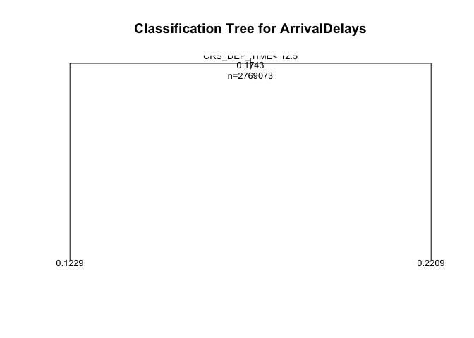

    par(mfrow=c(1,2)) # two plots on one page
    rsq.rpart(fit)

    ## 
    ## Regression tree:
    ## rpart(formula = formula, data = data_train, method = "anova")
    ## 
    ## Variables actually used in tree construction:
    ## [1] CRS_DEP_TIME
    ## 
    ## Root node error: 398452/2769073 = 0.14389
    ## 
    ## n= 2769073 
    ## 
    ##         CP nsplit rel error  xerror      xstd
    ## 1 0.016644      0   1.00000 1.00000 0.0010321
    ## 2 0.010000      1   0.98336 0.98336 0.0010085

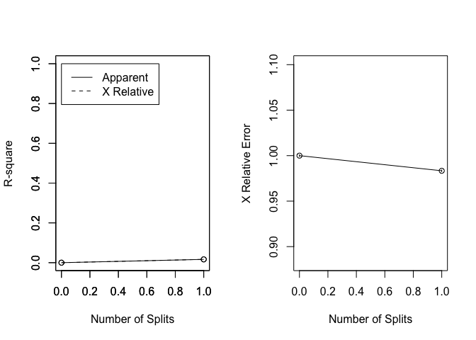

The decision tree algorithm did a pretty good job with:

Accuracy: 82.10%

Senstivity: 31%

Specificity: 99%

**CONCLUSION**

Based on the descriptive analysis, less number of arrival delays are in
April, May, September, October and November. And for the week days, the
best time to travel is on Saturdays, Tuesdays and Wednesdays to expect
least arrival delays. Carriers with the most arrival delays are American
Airlines and Soutwest Airlines. These are the airlines that carry the
most traffic and have the most number of flights.

Both supervised learning algorithms K-NN and Decision Tree predict the
arrival delays with accuracy of around 82%. The decision tree model was
run on the entire dataset preceeded by equal division into training and
testing sets(1:1). For k-nn 180000 data points were chosen and model
was trained and tested on the training and testing sets of (1:90000) and
(90001:180000) data points respectively. The future work might extend to
incorporate the departure delay feature and weather data into the models
to achieve better accuracy as these also impact the arrival delays.
